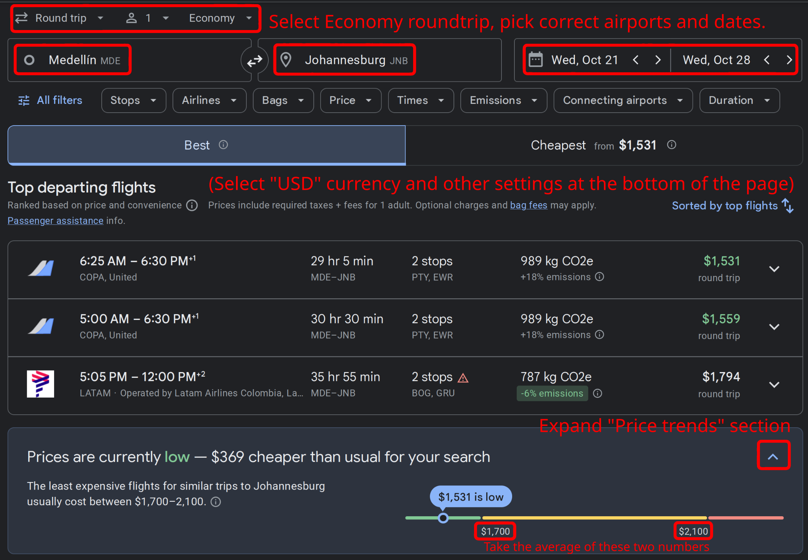
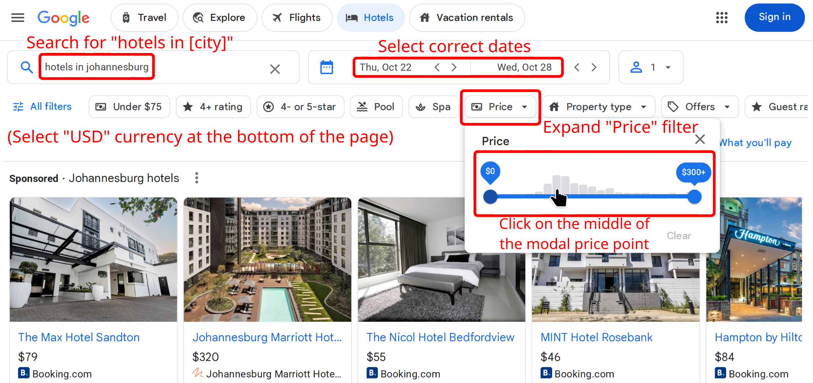
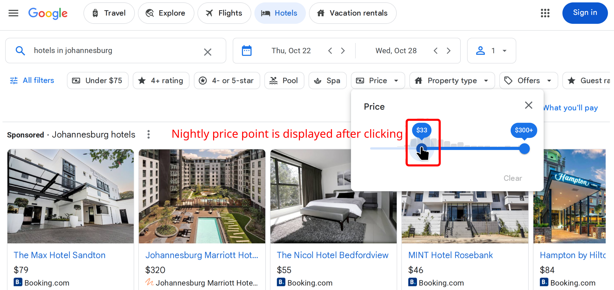

# Walletbeat travel policy

This document describes the policy for travel expense reimbursement for Walletbeat contributors.

## tl;dr / just the numbers

- **Airfare**: Capped per Google Flights data
- **Hotel**: Capped per Google Hotel Search data
- **Stipend**: 50 USD per night stayed
- **Swag**: 400 USD per event
- **Trips**: Max 2 trips per 360 days per contributor
- **Total**: 4,000 USD cap per trip, excluding swag
- **Treasury travel budget**: Max 15% over 360 days period

## Motivation

Walletbeat is a public good, and all public goods are budget-constrained by nature.
However, Walletbeat's mission as a wallet ecosystem advocacy organization cannot be
realized without community engagement, recognition, and outreach, and travel is a necessary expense
to achieve meaningful community engagement.

This policy aims to balance this tension by delineating what constitutes reasonable and impactful travel for Walletbeat contributors, to ensure travel expenses are reasonable and that treasury funds are effectively deployed towards mission-impactful goals.

## Qualifying events

Walletbeat will only reimburse expenses for events that meet all of the following:

- The event is a recurring event (e.g. yearly conference) or is organized by a group that has a history of running events longer than 3 years (e.g. Web3Privacy, Devcon).
  - Rationale: Unproven events have unproven impact and unpredictable attendance numbers.
- The event's past iterations have had 3-year-rolling-average attendance of 500 attendees or higher.
- The event is meaningfully related to Walletbeat's mission.
- The event is either not run by a wallet entity, or, if it is, the Walletbeat contributor refuses all compensation from the wallet entity.

NOTE: Walletbeat contributors can still go to non-qualifying events; they simply will not be reimbursed.

## Qualifying contributors

Contributors that apply for reimbursement must meet all of the following criteria:

- The contributor must be a _significant_ Walletbeat contributor, as defined by the following:
  - Started contributing to Walletbeat at least 180 days ago.
  - Contributed to Walletbeat for at least 45 hours of their time within the last 90 days. _(This averages to 30 minutes per day for each of the last 90 days, or around 45 minutes per non-weekend day.)_
- Contributors cannot be reimbursed for more than two events per 360 days period.
  - Rationale: This encourages spreading the travel budget across contributors to avoid any one contributor from spending a lot of the budget early on, and ensures that Walletbeat's image does not become too closely associated with any one specific contributor.
- For any given event, if there are more than two contributors planning to attend, only the expenses of the two lowest-cost contributors may be reimbursed.
  - Rationale: This favors local contributors over far-away ones, in order to minimize total expenses, and encourages spreading event attendance over multiple events rather than concentrating attendance into any one single event.
- The contributor must not belong to any organization that sponsors the event, unless Walletbeat itself is sponsoring the event.
- The contributor must have a plan for how they will be furthering Walletbeat's mission at the event. See below for examples of what this entails.
  - Rationale: As reimbursement funds come from the project treasury, they should only be spent on expenses that further the project's mission.

NOTE: Walletbeat contributors can still go to events even if they do not qualify for reimbursement; they simply will not be reimbursed.

## Qualifying impact plans

Contributors that apply for reimbursement must prepare a plan for how they will further Walletbeat's mission by attending the event. For example:

- Propose a talk or a workshop related to Walletbeat.
  - Talks and workshops can be either directly about Walletbeat, either around Walletbeat's mission. For example, a talk around Ethereum values qualifies as well.
  - Reimbursement is contingent on acceptance by the event organizers.
- Run a Walletbeat booth or demo station at the event.
  - Reimbursement is contingent on the booth being accepted.
- Participate in a panel related to wallets or Walletbeat.
  - Reimbursement is contingent on acceptance by the event organizers.
- Run a Walletbeat class or curriculum session at an educational event.
  - Reimbursement is contingent on acceptance by the event organizers.
- Appear on a podcast (recorded at the event) related to Walletbeat.
  - Podcast must be reputable (more than 10,000 subscribers).
  - Reimbursement is contingent on acceptance by the podcast organizers.
- Participate in wallet-related event or workshop where Walletbeat's attendance is valuable.
  - Examples: Wallet industry groups for establishing EIP/ERC standards that impact wallets.
  - Three or more distinct wallet teams must attend. Events with fewer than this number do not qualify.
  - Reimbursement is contingent on being accepted into the event.

Contributors must also show the impact _after_ the event in order to obtain reimbursement. See "After the event" section below.

## Expenses covered

Walletbeat will reimburse the following expenses:

- Air or rail travel expenses for a contributor to get to a conference or event, up to the 12-month average price of a roundtrip ticket per Google Flights (see below).
- Hotel or similar lodging accommodations for a contributor to remain at the event for its duration, up to the modal per-night price reported on Google Hotel Search at least 60 days prior to the event (see below).
- A flat stipend of 50 USD per night stayed, intended to cover food, travel between lodging and event space, and other miscellaneous expenses.
- Cost of swag and promotional material to be distributed at the event, up to 400 USD.

Walletbeat will **not** reimburse anything not listed in the earlier list. Notably, this means the following expenses are **not** covered:

- Event ticket price.
  - This encourages contributors to obtain free attendance to the event, by applying as a speaker or similar role. Conferences that make speakers or volunteers pay for their attendance are probably not worth attending.
  - This also encourages contributors to remain focused on community-centric events and conferences, which tend to have ticket prices one or two orders of magnitude lower than corporate-oriented events and conferences. Walletbeat's mission is community outreach, so any impact from corporate-oriented event is generally not worth the expense.
- Incidental expenses.
- Travel-related insurance, healthcare expenses, taxes, or other add-on fees.

## Monetary amount available for reimbursement

When applying for reimbursement, the reimbursement expenses must be capped per the following:

### Capping airfare expenses

To encourage contributors to book airfare at competitive prices, the maximum amount of reimbursed airfare costs is determined to be the 12-month average of a roundtrip ticket for this flight, as determined using Google Flights. To obtain this figure:

- Go to [Google Flights](https://flights.google.com).
- Go to the bottom of the page and select:
  - Language: `English (United States)`
  - Location: `United States`
  - Currency: `USD`
  - _Rationale: These settings all affect the ticket prices shown. Since this policy standardizes on USD, this uses US prices._
- Search for the **roundtrip** ticket from your departure airport to the event destination airport, with the intended travel dates.
- Do not apply any other filters.
- Expand the "See price history" section and screenshot it:



The airfare coverage is the average of the two numbers shown. For example, in the above screenshot, this would be `(1700 + 2100) / 2 = 1900 USD`.

If a contributor finds a cheaper option than this figure, they can choose to either pocket the difference, or to only apply for reimbursement for the figure they actually paid.

### Capping lodging accommodation expenses

To encourage contributors to book lodging accommodations at competitive prices, the maximum amount of reimbursed lodging costs is determined to be the modal nightly price of a hotel in the city the event is held in, as determined using Google Hotel Search. To obtain this figure:

- Go to [Google Hotel Search](https://www.google.com/travel/search).
- Go to the bottom of the page and select:
  - Currency: `USD`
  - _Rationale: These settings all affect the ticket prices shown. Since this policy standardizes on USD, this uses US prices._
- Search for the query string `hotels in city_name`, with the intended dates (remember that your flight may land the next day from the time your flight starts; adjust dates accordingly).
- Do not apply any other filters.
- Click the "Price" filter and look at the histogram of prices.
- Click the middle of the modal price band (i.e. the price point with the most options) to determine the nightly amount. If there are multiple similar bands, pick the lowest one.
- Screenshot it:





The hotel coverage amount per night is the number shown.

If a contributor finds a cheaper option than this figure, they can choose to either pocket the difference, or to only apply for reimbursement for the figure they actually paid.

NOTE: Google Hotel Search also has a "What you'll pay" section; however, this section shows prices to stay in hotels _right now_, not at the time of travel. Therefore, you must use the "Price" filter histogram instead. If Google Hotel Search fixes this bug in the future, this policy will be updated accordingly.

### Capping total expenses

The total reimbursement amount:

- Must not exceed 4,000 USD per trip. Swag costs are excluded from this cap.
- Total travel expenses across all contributors and all trips over the last 360 days period must not exceed 15% of the total treasury funds; otherwise, the reimbursement amount is capped accordingly.

### Putting it all together

As a math formula, the final reimbursement amount can be computed by the following pseudocode (all currency amounts in USD):

```
// Populate the following numbers:
num_days_of_event = ... // Number of days the event spans, not the amount of nights you are staying.
average_roundtrip_airfare_per_google_flights_usd = ...
modal_hotel_cost_per_night_per_google_hotel_search_usd = ...
swag_cost_usd = ...
treasury_current_value_usd = ...
treasury_total_travel_expenses_in_last_360_days_usd = ...

// Computation:
num_stayed_days = num_days_of_event + 1  // One night per event day + night preceding event
reimbursed_airfare = average_roundtrip_airfare_per_google_flights_usd
reimbursed_hotel = modal_hotel_cost_per_night_per_google_hotel_search_usd * num_stayed_days
reimbursed_stipend = 50 * num_stayed_days
treasury_travel_budget_remaining_usd = max(
	0,
	treasury_current_value_usd * 0.15 - treasury_total_travel_expenses_in_last_360_days_usd,
)
reimbursed_non_swag = min(
	4000,
	reimbursed_airfare + reimbursed_hotel + reimbursed_stipend,
)
reimbursed_swag = min(400, swag_cost_usd)
reimbursed_total_amount_usd = min(
	reimbursed_non_swag + reimbursed_swag,
	treasury_travel_budget_remaining_usd,
)
```

## Reimbursement process

### Before the event

Contributors must request budget approval for travel. This includes:

- Showing that the event qualifies, per this policy.
- Showing that they qualify to attend the event, per this policy.
- Showing that the treasury's budget constraints allow for reimbursement, per this policy.
- Show screenshots of the airfare and hotel nightly price points, similar to above.

Contributors must post to GitHub Discussions. Approval is granted by majority vote of treasury signers.
If the contributor is a treasury signer, their vote does not count.

Funds are not disbursed at approval time; they are reimbursed after the trip.

### During the event

Focus on enjoying the event and fulfilling Walletbeat's mission.

### After the event

Within 30 days of return, contributors that were approved for reimbursement must produce and publish some form of trip report or artifact that shows the impact of their attendance. This can take the shape of a public talk recording, interview or podcast recording, or a document reporting the impact of the contributor's attendance to the event. Quantified forms of impact are encouraged, e.g. number of wallet teams reached, number of potential new Walletbeat contributors engaged, etc.

Contributors are **not** required to produce receipts of their expenses; the policy and amounts reimbursed are designed to not require this information to be made available, which is necessary to allow anonymous maintainers to preserve their anonymity.

Contributors must commit their impact artifacts to the Walletbeat code repository (if possible, e.g. document), or commit a text file with links to said artifacts otherwise, along with a reimbursement address (unless already known from past treasury operations).

Approval for reimbursement is implicitly granted by treasury signers actually sending the funds.
If the contributor is a treasury signer, they **can** contribute to signing the reimbursement transaction.

## FAQ

### What if I want to arrive earlier or stay longer than the event's duration?

Lodging expenses only extend up to the night before the first day of the event, and the night immediately following the last day of the event. In other words, for an event spanning 7 days, reimbursement covers 8 hotel nights. This allows contributors to arrive the day before the event starts, and to leave the day after the event ends. Contributors wishing to extend their stay must pay for the remainder.

### What if I want to combine the transportation tickets to go somewhere else afterwards, rather than a roundtrip?

The amount of covered airfare is the average price of a roundtrip ticket from your current location. If you purchase any other itinerary, only the amount of the airfare up to that amount is covered; the rest is your expense. If your airfare expenses are lower than the cost of a roundtrip ticket, you can pocket the difference.

### What if I am chaining multiple qualifying events in the same airfare?

Apply for reimbursement for both events independently. If approved for both, and your total out-of-pocket costs are lower, you may pocket the difference. If not approved for both, reimbursement is capped to the approved amount.
