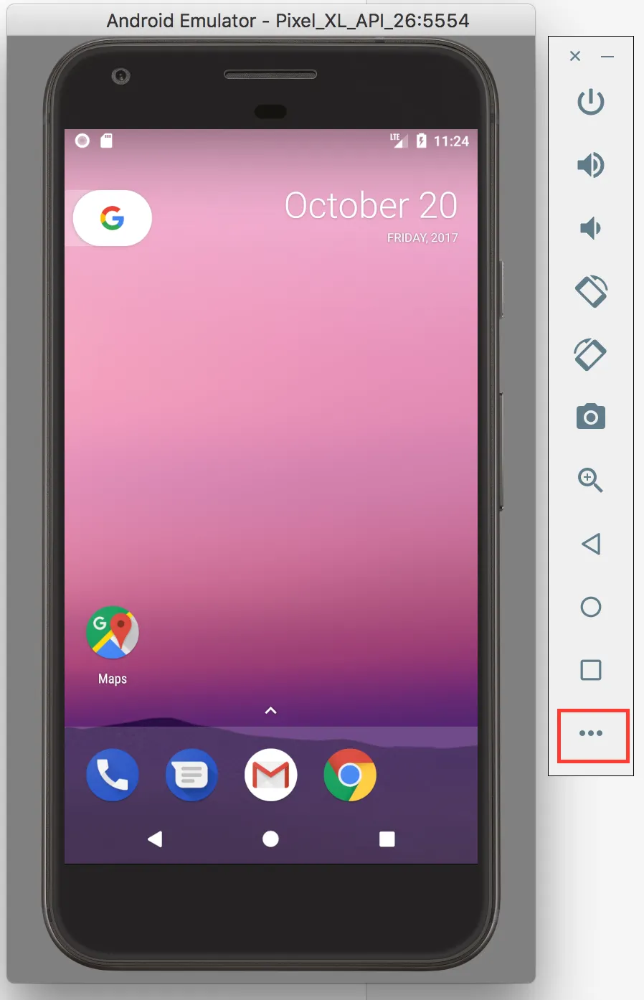
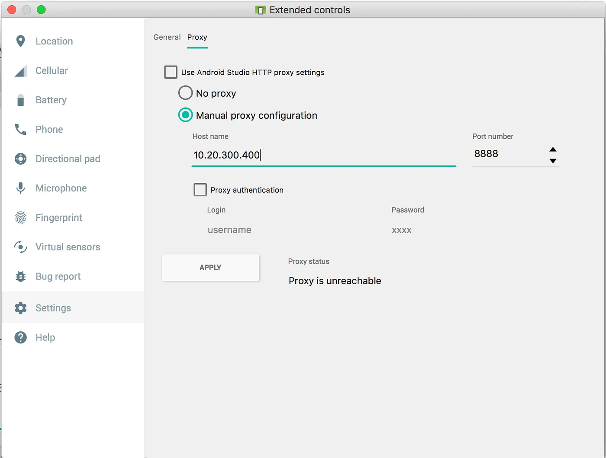
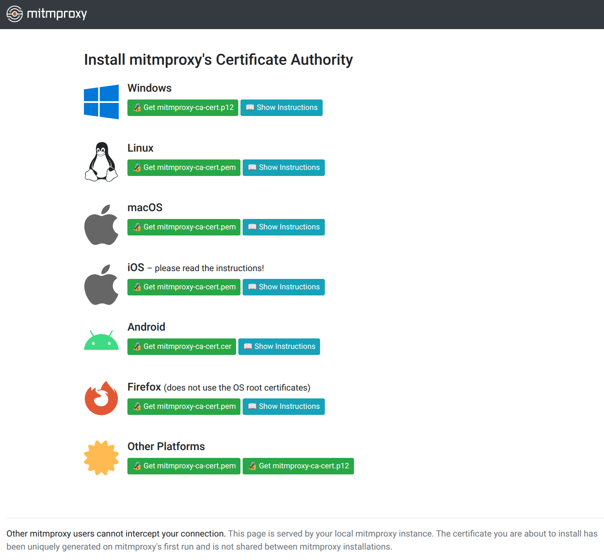
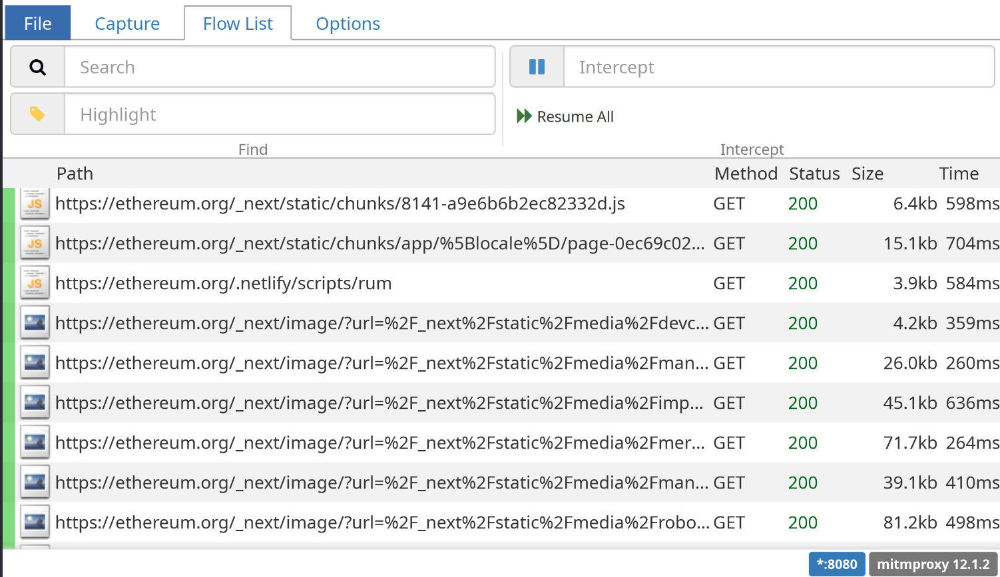

# `mitmproxy` guide

_This guide describes how to set up [`mitmproxy`](https://mitmproxy.org) to inspect the network traffic that a wallet generates._

## Why?

This analysis is crucial in order to determine certain wallet attributes, such as:

- **Private key handling**: Does any external provider learn of your seed phrase or private key?
- **Wallet address privacy**: Is your Ethereum address linkable to other information about yourself?
- **Multi-address privacy**: Can your multiple wallet addresses be correlated with one another?
- **Account portability**: Does the wallet rely on any external service to export your credentials, i.e. is this external provider in a position to deny exporting your account data?
- **Orderflow transparency**: Which external services get to see your transaction data before it is included onchain, and is therefore in a place where they can frontrun you?
- **Browsing history leakage**: Does the wallet leak your visited sites to any external provider? (Yes, some wallets have done this.)

Therefore, it is important that the data gathered using this technique is comprehensive and accurate.

## Step-by-step

### Step 1: Install `mitmproxy`

You will need a desktop computer for this. Installation instructions differ based on your operating system. Follow the [`mitmproxy` installation guide](https://docs.mitmproxy.org/stable/overview/installation/) for your operating system.

### Step 2: Create a dedicated browser or device for wallet testing

In order to eliminate noise from the network capture you are about to do, it is imperative to use a dedicated browser or mobile device for wallet testing.

- **For browser extension wallet testing**: The easiest way is to use a different profile. Different browsers have different ways to do this. For Chromium, run `chromium --user-data-dir=/tmp/walletbeat-test-browser` in your terminal. This will launch a dedicated `chromium` browser that lives completely separately from whatever other browser you may otherwise use. All browser-related files will be stored in `/tmp/walletbeat-test-browser`, all settings will be unique to this browser, and all extensions will apply to this browser only.

* **For mobile app wallet testing**: The easiest way is to use an emulated Android device using [Android Studio](https://developer.android.com/studio). Create a new emulated device for the purpose of wallet testing.

### Step 3: Set up your browser or device for `mitmproxy`

As the name implies, `mitmproxy` is a proxy. This means it intercepts requests and forwards them onto their initially-intended destination.
Putting `mitmproxy` in a place where it _can_ intercept requests from a wallet is a 2-step process:

#### Step 3.a: Set up proxy settings

You will need to configure your browser or mobile device to use `mitmproxy` as a proxy. This is browser-dependent (or device-dependent); what's not device dependent is the `mitmproxy` proxy settings: the IP is `127.0.0.1` and the port number is `8080`.

- **For browser extension wallet testing**: Set your browser's proxy settings. This is usually located in the settings. If using a dedicated `chromium` profile from earlier, you can also specify it on the command line: `chromium --user-data-dir=/tmp/walletbeat-test-browser --proxy-server=http://127.0.0.1:8080`
- **For mobile app wallet testing**: Go to the the Android Studio's settings for the emulated device (**not** the "Settings" app inside the emulated device itself), and you can set device-wide proxy configuration here:




Unlike the above screenshot, you will want `127.0.0.1` as "Host name", and `8080` as port.

#### Step 3.b: Install the `mitmproxy` certificate

Because `mitmproxy` needs to intercept authenticated HTTPS connections, it needs to use a certificate that your browser or mobile device will initially be very suspicious of. HTTPS is _designed_ to prevent request interception, which is why you will see lots of scary warnings in the process of adding a trusted certificate. Nonetheless, this is required for `mitmproxy` to be able to intercept authenticated requests and show their contents.

To do this, navigate to `http://mitm.it`. If you get a page that says "traffic is not passing through mitmproxy", then go back through this guide and figure out what went wrong. Otherwise, you should get a page that looks like this:



Follow the appropriate instructions for your operating system or platform. You may need to restart your browser or device after certificate installation.

### Step 4: Verify setup

On your test browser or mobile device, go to `http://mitm.it`. If you get a page that says "traffic is not passing through mitmproxy", then go back through this guide and figure out what went wrong.

Then, navigate to some other page, such as [Ethereum.org](https://ethereum.org). Once the page has loaded, go to the `mitmweb` web UI, and you should see something like this:



If you see this, congrats, you are ready to start testing!

### Step 5: Follow instructions from the `wallet-data-collection` tool

Run `pnpm wallet-data-collection --id=<wallet_id> --type=<SOFTWARE|HARDWARE> --variant=<BROWSER|MOBILE|...> check`. If you did everything correctly up to this point, you will get a message like this:

```shell
$ pnpm wallet-data-collection --id=rabby --type=SOFTWARE --variant=BROWSER check
# Capture (1 issue):
  > No network capture data for this wallet.
    Suggestion:
      - Start capturing data for the IDLE_PRE_INSTALL flow.
        $ pnpm wallet-data-collection --id=rabby --variant=BROWSER capture --flow=IDLE_PRE_INSTALL
```

From this point forward, you should use the output of this `check` command as your guide for what to do next. It will suggest which subcommand of the `pnpm wallet-data-collection` you need to run, and each subcommand will come with its own set of instructions as to how to use it. You can also [read the `pnpm wallet-data-collection` tool's manual](../../../../src/tools/wallet-data-collection/README.md) for more information.

At the end of this process, you should have the following output:

```shell
$ pnpm wallet-data-collection --id=rabby --type=SOFTWARE --variant=BROWSER check
✅ No issues found! Wallet capture process complete. Well done.
```

Yes, this is tiresome work. It can be the toughest part of the wallet rating process. It is also generally quite eye-opening as to how much data a wallet may be leaking out to several providers. Godspeed! 🫡

### Step 7: Plumbing the captured data into Walletbeat's rating system

Once the `pnpm wallet-data-collection` capture and annotation process is complete, you can now hook up the data it has produced to Walletbeat's data about the wallet you just rated.

```typescript
// Add this import:
import walletDataCollection from '@/data/software-wallets/collection/<wallet_id>/wallet-data-collection.ts'

export const someWallet: SoftwareWallet = {
	features: {
		// [...]
		privacy: {
			// Set this field to the data you just imported:
			dataCollection: walletDataCollection,
		},
	},
}
```

Once this is done, run the unit tests (`pnpm vitest`) to verify the integrity of the data. If everything passes, you are done! 🫡
