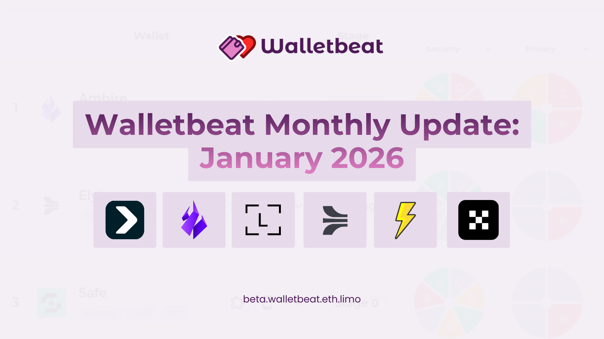

---
Tweet #1
Walletbeat January monthly update is here!

Check out what happened across Walletbeat and the wallet ecosystem 👇
---
Tweet #2
OKX Wallet has been added to Walletbeat.

OKX describes itself as “a universal crypto wallet available on multiple platforms.”
---
Tweet #3
Bitget Wallet is now live on Walletbeat as well.

Bitget describes itself as “a leading multi-chain decentralized wallet.”
---
Tweet #4
Zeus Wallet has also joined the Walletbeat ratings.

Zeus describes itself as a truly seedless, decentralized, self-custodial Ethereum wallet.

Special thanks to @mikemolfetas1 for the contribution!
---
Tweet #5
Elytro’s public audits have now been added to its Walletbeat profile, improving transparency in its rating.
---
Tweet #6
Two major updates for Ambire:

- Transaction legibility is now fully updated, completing the data needed for a full Walletbeat rating.
- Ambire shipped an update and now passes the Chain Configurability rating.