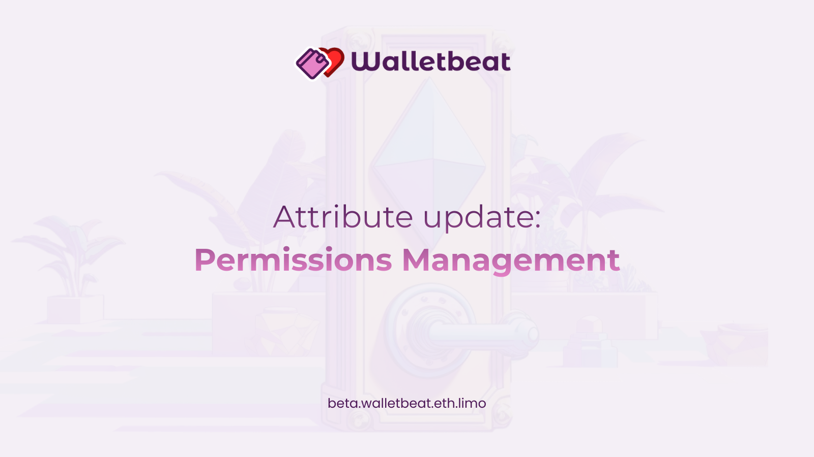

New Walletbeat attribute just dropped: 
Permissions Management 🤹

This answers a simple but critical question:

Does your wallet let you inspect and manage the permissions you've granted to other contracts and apps?

---

Token approvals = giving apps permission to spend your assets.

The problem?
Most users forget about them.

And if a contract gets compromised, your funds are at risk.

---

Walletbeat evaluates wallets based on 3 levels:

❌ Can’t inspect approvals

⚠️ Can inspect but can’t revoke

✅ Can inspect AND revoke

Across ERC-20, ERC-721, and ERC-1155.

---

Why this matters:

If you can’t revoke approvals,
you don’t fully control your assets.

Permissions management is an important part of maintaining control over your assets.

AA wallets will go further: spend limits, subscriptions, wrench-attack protection. 
Methodology updates will be coming as wallets adopt these.