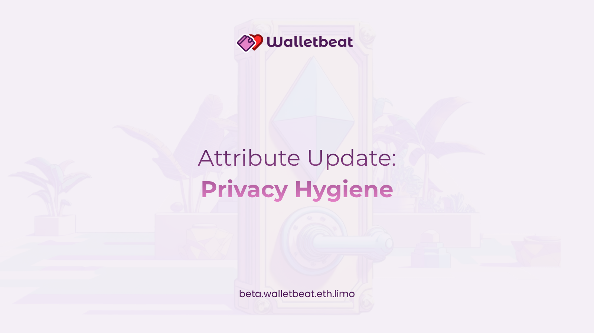

New Walletbeat attribute just dropped:
General Privacy Hygiene 🧼

This answers a simple but important question:

Does your wallet respect your privacy by default?

---

Wallets handle sensitive context.

They know which apps you visit.
They can track your activity as you use the web and the wallet itself.

If that data gets sent to external services without your knowledge, it's a privacy violation, not a feature.

---

Walletbeat evaluates wallets on two dimensions:

1. Does the wallet send browsing history or connected domains to external services by default?
2. Does the wallet use analytics without asking for consent first?

---

Rating scale:

❌ Sends browsing history without consent, or uses product usage analytics without asking first.

⚠️ Only crash/error reports sent without consent.

✅ Doesn't send sensitive data by default.

Or, of course, you know:
✅ The wallet simply doesn't track the user.

---

Why this matters:

Privacy should be the default, not something you opt into.

If your wallet reveals your personal information to other parties without your consent, that's a problem.

---

Hardware wallets are exempt from this attribute, as they are disconnected from the Internet by default.

Software companion applications to hardware wallets are not exempt.

https://x.com/sethforprivacy/status/1658544668433342494
