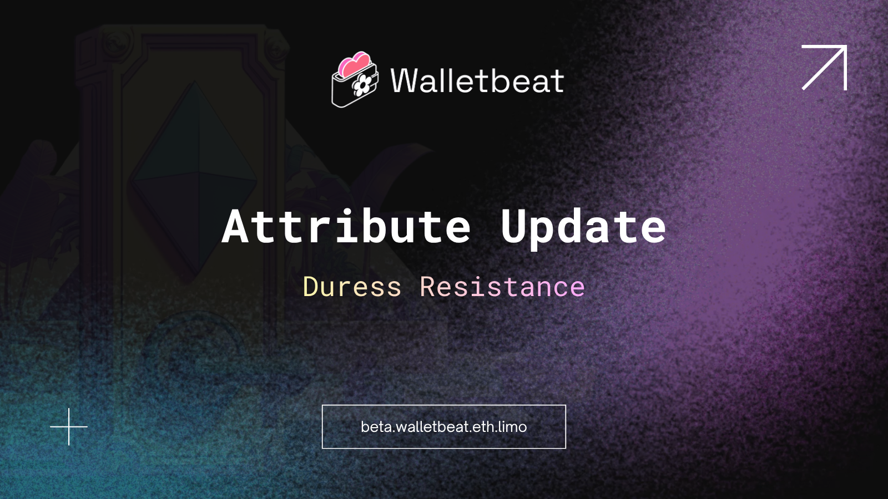

You secured your seed phrase. You use a hardware wallet. You're careful.

But what if you're being forced to open it?

New Walletbeat attribute: Duress Resistance 🔧

---

Wrench attacks are real.

Physical coercion doesn't care how strong your password is.
If you're forced to hand over access, encryption won't save you.

---

Duress resistance is your wallet's ability to protect you under physical threat.

A separate credential (a duress PIN or passphrase) triggers a protective action when entered.

---

Wallets can implement this in different ways:

• Decoy wallet — opens a separate wallet with different accounts and balances
• Self-destruct — wipes all wallet data
• Wipe and forward — wipes data and sends funds to a pre-configured safe address
• Onchain lockdown — freezes the smart contract, blocking unauthorized transfers

---

Walletbeat evaluates wallets on three levels:

❌ No lock screen at all, anyone who picks up your phone can access your funds.

⚠️ Has a lock screen, but no dedicated duress mode.

✅ Has a duress PIN or passphrase that triggers a protective action.

---

Why this matters:

No amount of cryptographic security can stop an attacker standing next to you with a weapon.

This is a different threat model, and most wallets don't account for it.

---

Desktop, browser extension, and embedded wallets are exempt from this attribute.

This one applies to mobile wallets only.
