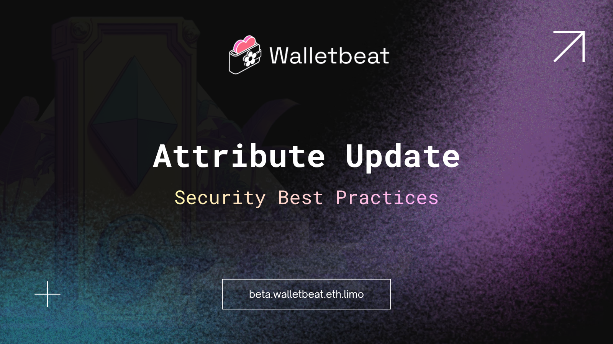

New Walletbeat attribute just dropped:
Security Best Practices 🔐

You trust your wallet with your keys.
But how is it actually handling them under the hood?

---

Most users focus on what a wallet can do.
Few ask how it's built.

Security best practices are the fundamentals that determine whether your keys are actually safe, or just assumed that it is.

---

This attribute evaluates wallets across several areas:
Key storage, secure randomness, key generation location, app permissions.

---

Key storage: are your private keys stored in a hardware security module, encrypted at rest, or sitting in plaintext?

---

Secure randomness: does key generation use a cryptographically secure source, or a weaker source of randomness?

---

Key generation location: are your keys generated on your device, or on external servers you don't control?

---

App permissions: does the wallet request only what it needs, or does it over-permission itself? Applies to browser extensions and mobile apps alike.

---

Rating scale:

❌ Keys generated off-device, stored with weak encryption, or using a non-standard RNG.

⚠️ Keys generated on-device but with partial protections. e.g. OS-sandboxed plaintext storage, or only a software-level KDF.

✅ Keys generated on-device, stored in a hardware security module or secure enclave, using OS CSPRNG or hardware entropy.

---

Why this matters:

A wallet can look polished and still have poor security fundamentals.

These aren't advanced features. They're the fundamentals.

Getting these right is the foundation everything else builds on.

---

Hardware wallets are exempt from this attribute, they handle key security through dedicated physical security mechanisms.
