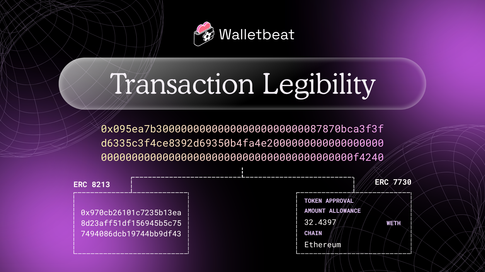

Transaction Legibility: ERC-8213 & ERC-7730

Walletbeat now tracks both.

Two standards. One goal: Improve Ethereum UX

---

Blind signing is one of Ethereum's biggest UX problems.

Billions lost to hacks, just because users didn't understand what they were approving.

ERC-8213 and ERC-7730 are here to change that.

---

ERC-8213: Calldata Digest & EIP-712 Digest

If you've ever verified a transaction on a hardware wallet, you probably know the struggle.

A wall of hex. Unreadable. You're expected to confirm something you can't actually parse.

---

ERC-8213 takes all that hex and hashes it into a single 32-byte digest.

One hash. That's it.

Instead of scanning hundreds of characters, you compare one string. And confirm the transaction hasn't been tampered with.

---

ERC-7730: Clear Signing

ERC-7730 makes the transaction human-readable, right on your screen.

---

Instead of raw calldata, a Clear Signing wallet shows you:

• "Approve Uniswap to spend up to 500 USDC from your wallet"
• "Supply 1 USDC to AAVE"

No hex. No guessing. You see exactly what you're signing.

---

Together, ERC-8213 and ERC-7730 tackle blind signing from two angles:

• ERC-8213: compress calldata into a verifiable digest
• ERC-7730: replace hex with human-readable context

Does your wallet support this yet?