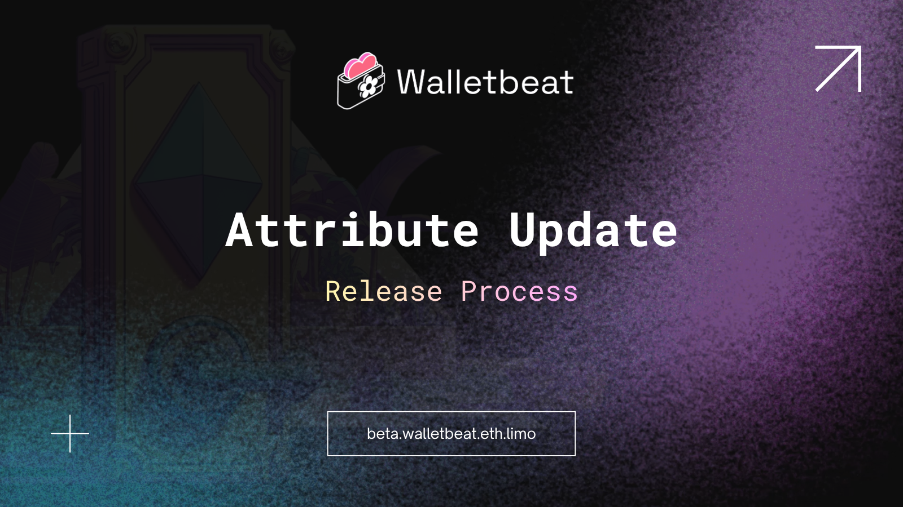

New Walletbeat attribute just dropped:
Release process 📦

Can users trust how this wallet's releases are built and distributed?

---

Most users focus on what a wallet can do.
Few ask how it's built and shipped.

Release process is about the pipeline behind every update, not just the features in the release notes.

---

Walletbeat checks four signals in two tiers:

Basic: public changelog, dependency locking
Advanced: artifact signing, reproducible or hermetic builds

---

Public changelog: does the wallet publish release notes or a changelog you can read before trusting an update?

You should know what changed between versions, not only after something breaks.

---

Dependency locking: does the build pin dependencies to known versions with a lockfile or equivalent?

Unpinned dependencies make it harder to reproduce builds, easier to ship unexpected changes between releases, and leave you unsure which external dependencies actually went into a given release.

---

Artifact signing: are release artifacts cryptographically signed, with signatures published where users or tooling can verify them?

Signing helps detect tampering. The file you downloaded should match what the project published.

---

Reproducible or hermetic builds: can independent parties verify that build output matches the published source?

• With reproducible builds, the same source revision yields a bit-for-bit identical artifact
• With hermetic builds, the build runs offline using a pre-fetched, integrity-verified input set

---

Rating scale:

❌ Fail: missing both basic and advanced tiers

⚠️ Partial: one or both tiers incomplete, e.g.:
• Basic tier only: changelog + lockfile, no signing or reproducible/hermetic builds
• Advanced without basic: signing + reproducible builds, but no changelog or lockfile

✅ Pass: both tiers complete (all four signals)

---

Why this matters:

A wallet can be widely used and still give you no way to verify an update.

These aren't advanced features. They're how you know what you're installing is what the team intended to release.

---

Hardware wallets are exempt from this attribute, as release process for hardware is tracked separately.

Check Release process ratings on Walletbeat:
https://beta.walletbeat.eth.limo
