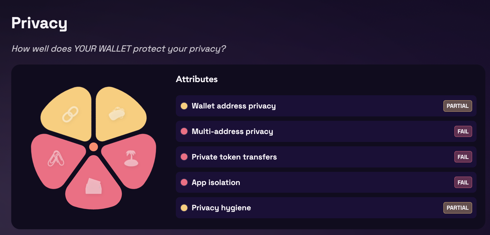
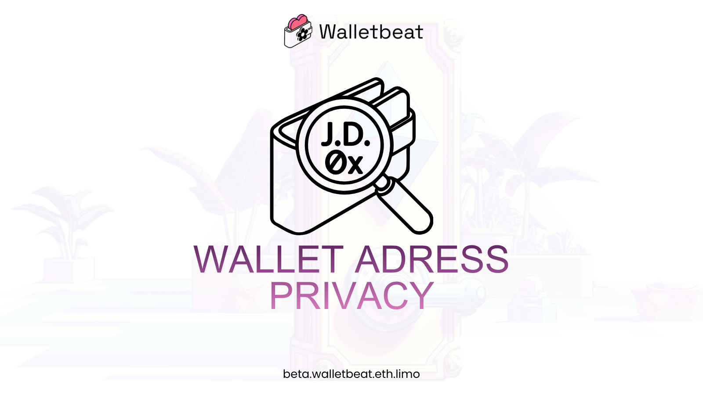
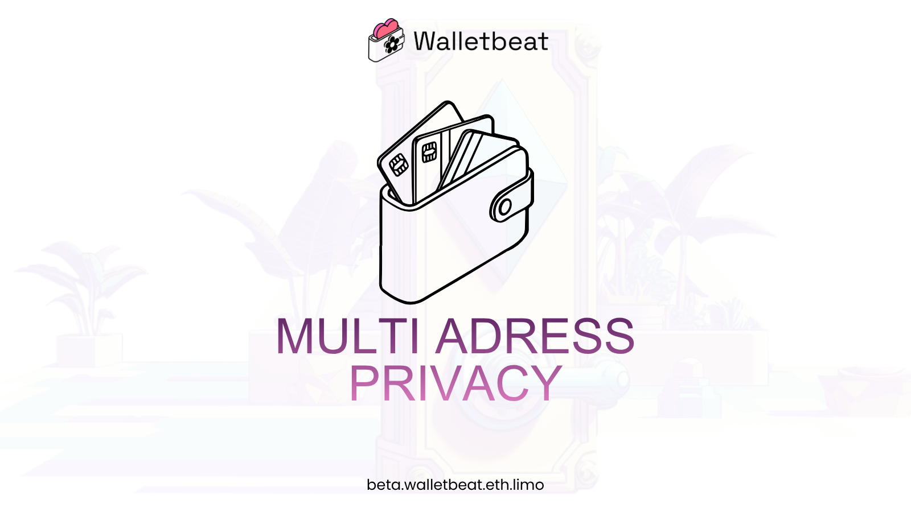
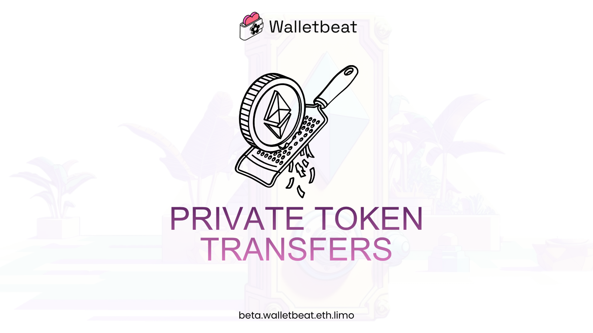
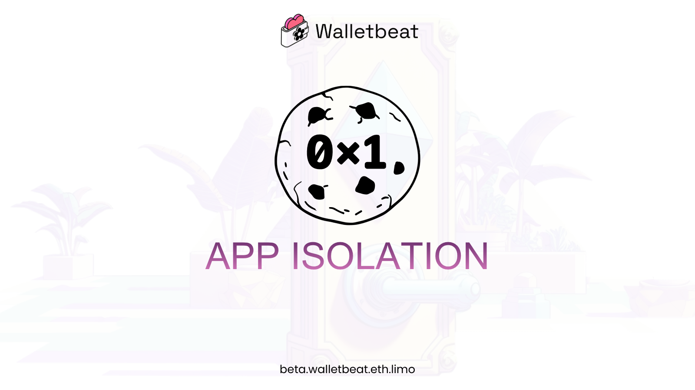
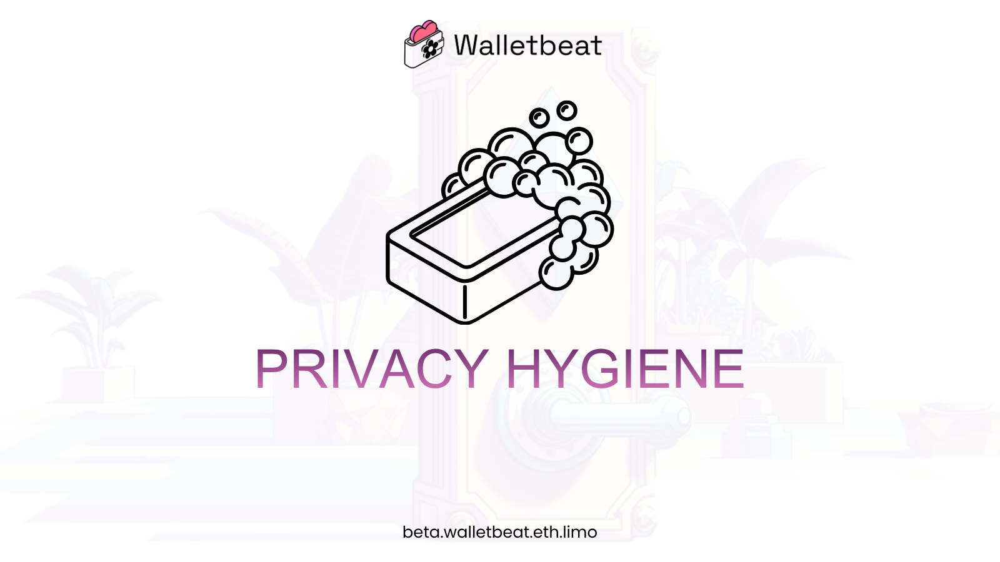

What does it actually mean for an Ethereum wallet to be "private"?

A Walletbeat thread 🧵

--- 

Privacy is one of the core values of Ethereum, yet it's often treated as a nice-to-have feature instead of a fundamental property of a wallet.

Wallet privacy is more than just "Does your wallet support private transfers?".

Here's how Walletbeat evaluates privacy, and why these attribute matters.

---

Wallet address Privacy

Is your wallet address linkable to other information about yourself?

Your wallet address is permanent and publicly visible. The more personal information linked to it, the easier it becomes to track your activity across apps, devices, and services. A private wallet minimizes that linkability.

----

Multi address Privacy

Can your multiple wallet addresses be correlated with one another?

Just like people have multiple emails for different purposes, they also have multiple addresses for different reasons. A private wallet should avoid unnecessarily revealing that those addresses belong to the same person.

---

Private token transfers

Can you send and receive tokens without revealing your transaction history to others?

Everything on Ethereum is public by default. Privacy tools exist, but they're only useful if wallets make them easy to use. A private wallet makes private transfers accessible to users.

---

App Isolation

If you connect to an app, will it be able to learn your past activity from other apps by default?

By default, wallets shouldn't encourage reusing the same account across every app or exposing more accounts than necessary. A private wallet allows users to create app-specific accounts during the connection flow and make privacy-preserving choices the default.

---

Privacy Hygiene

Does your wallet only send sensitive data with your explicit consent?

Users shouldn't have to wonder whether their wallet is sending analytics, crash reports, or account information without their knowledge. A private wallet only collects and sends sensitive data after explicit user consent.

---

"Privacy is no longer an afterthought." - VitalikButerin. Privacy, in Ethereum values, is present. Users experience Ethereum through wallets. But without wallets practicing these values, users can't experience them.

---

Check out our website here.
