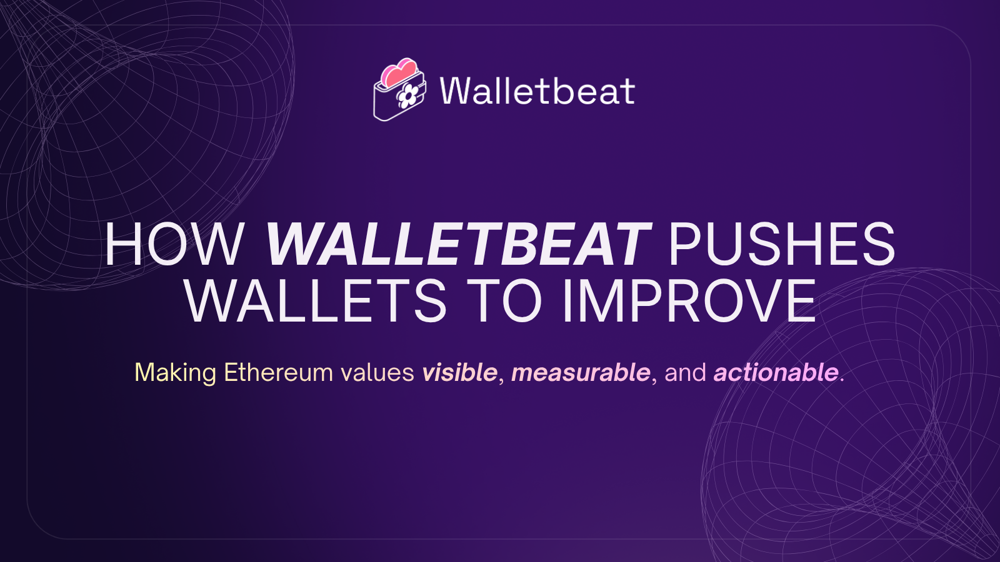
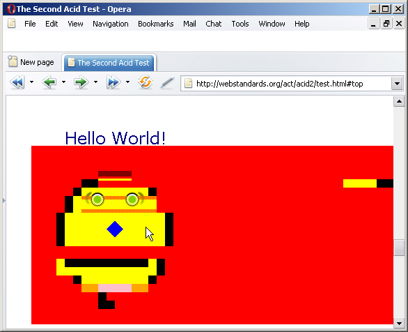
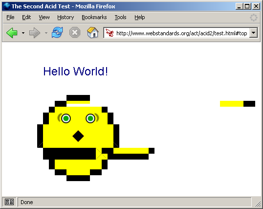

Talking about wallets alone does not improve wallets 

So how does Walletbeat actually push the ecosystem to get better?

---

Ethereum already has the CROPS values.

- Censorship Resistance
- Openness
- Privacy
- Security

The challenge has never been about defining these values. The challenge has always been making these values visible to the users.

---

You can't improve what nobody measures.

Walletbeat brings Ethereum's values into something wallets can actually compete on.

We make these values visible, measurable, and actionable.

---

We've already seen wallet teams respond. @Ambire @Metamask. Through discussions, we've seen them push changes towards improving.

Because when expectations become visible, wallets respond.

Quoting: https://x.com/walletbeat/status/2017683283664879872

---

This isn't a new idea.

During the browser wars, projects like Acid2 and Acid3 gave browsers a public benchmark for web standards.

Browsers competed to pass.

The web became better because of it.

---

Walletbeat aims to be the CROPS benchmark for Ethereum wallets.

A place where users know what to expect from a wallet, developers have a clear standard to build toward, and wallets compete on Ethereum values.

---

Walletbeat alone won't improve wallets.

But it helps create the expectations, discussions, and incentives that move the ecosystem in the right direction.
