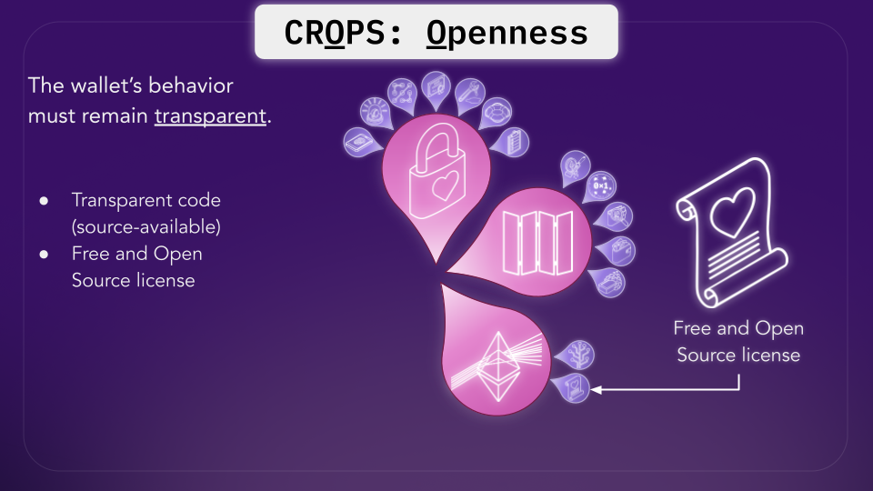
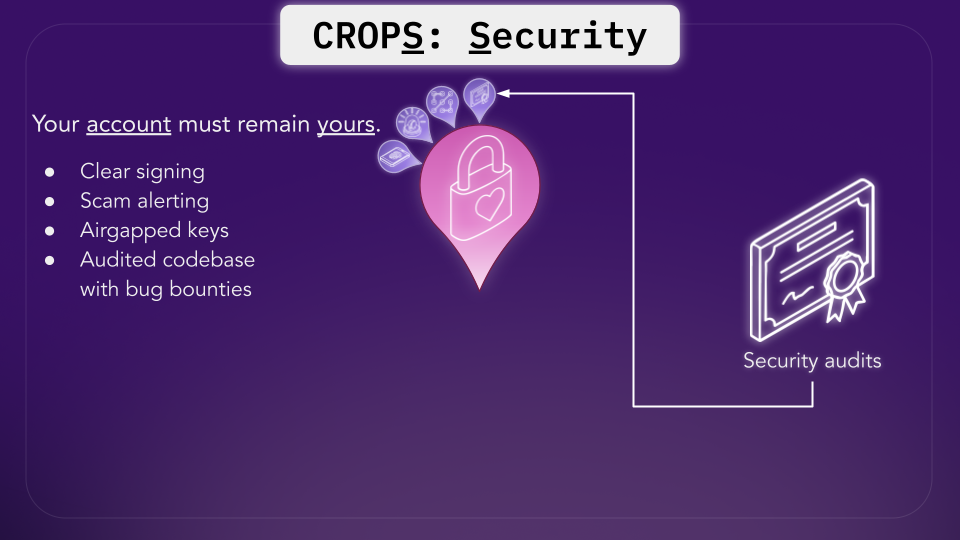

What happened with @ColdCardWallet, and how could they have prevented it?

## What happened?

During a 2021 code migration, seed generation accidentally started using MicroPython's software pseudo-random number generator (PRNG) instead of COLDCARD's intended hardware random number generator (RNG).

### What does this mean?

In simple terms, COLDCARD intended to use a hardware source of randomness to generate seed phrases with enough entropy that brute-forcing them would be computationally infeasible.

But after the migration, the seed-generation path was calling the wrong RNG implementation and not the intended hardware RNG.

That turned what should have been a computationally infeasible seed search into a potentially practical brute-force attack.

## How could they have prevented it?

At Walletbeat, we look beyond what the **vulnerability** was and ask what wallet providers could have done to better protect their users.

The direct technical failure here was insecure seed generation. But wallet security goes beyond preventing this specific bug.

### Multiple Sources of Entropy

COLDCARD supports adding entropy through dice rolls, but this is optional and requires user interaction. Seed generation should automatically and correctly mix multiple independent entropy sources to maintain stronger security and reduce reliance on any single source of randomness.

This provides another layer of defense when generating one of the most security-critical pieces of information in a wallet: the user's seed.

### Security Audits

Wallets are high-stakes software where vulnerabilities can directly put user funds at risk. At Walletbeat, we suggest that independent security audits should be conducted at least once a year, providing another layer of scrutiny that can uncover vulnerabilities or integration mistakes internal reviews may miss.

### Bug bounty program

We also push that wallets should maintain an active bug bounty program. Audits are periodic and don't guarantee vulnerability-free software, while bug bounties continuously incentivize security researchers and white-hat hackers to responsibly find and disclose vulnerabilities before they can be exploited by bad actors.

### Free and Open Source Software (FOSS)

While COLDCARD's firmware source code is publicly available, it is source-available rather than FOSS. Its license includes the Commons Clause, which restricts the right to sell the software. FOSS isn't just about being able to read the code. It gives the broader ecosystem the freedom to use, study, modify, redistribute, and build upon it.

For wallet security, this helps create a culture where independent researchers can inspect implementations, build security tooling around them, publish improvements, and contribute their findings back to the ecosystem.

## Conclusion

Wallets are one of the most critical layers of the crypto ecosystem. They hold the keys to our assets and are where we authorize transactions. While insecure RNG was the direct technical failure in this case, wallet teams should meet a high bar for security and adopt practice to ensure that users funds are safe.

Incidents like this are difficult for the ecosystem, especially for those affected. But we're optimistic that learning from these failures and raising the bar for wallet security will make crypto wallets better over time.

*Note: Walletbeat currently focuses on evaluating Ethereum software wallets and does not yet rate hardware wallets. But we care about the broader crypto ecosystem and recognize the impact this vulnerability has had on affected users. Secure RNG sourcing is already relevant to how we evaluate software wallets, and this incident reinforces that randomness and entropy sourcing should remain an important part of how Walletbeat evaluates wallet security.*
