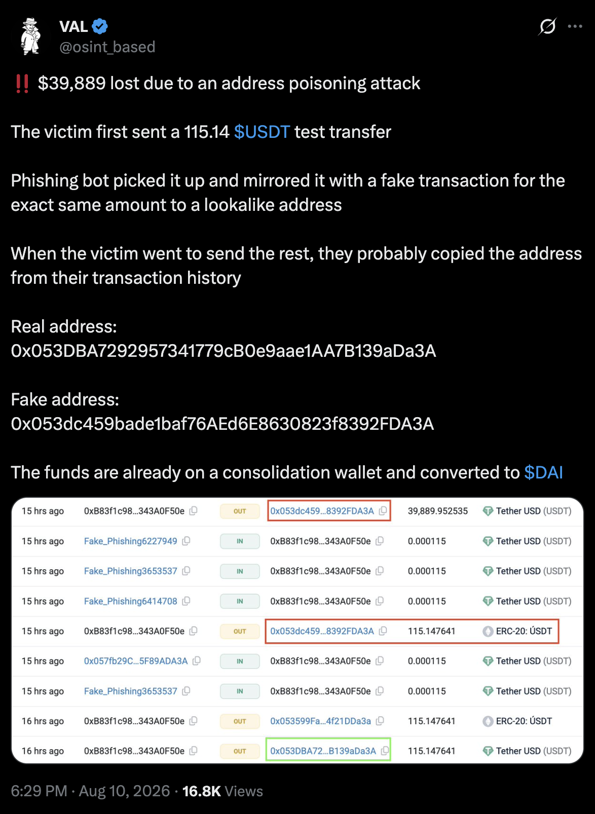

Quoting: https://x.com/osint_based/status/2086761829770903633

---

Address poisoning is a common scam where attackers try to trick users into sending funds to the wrong address.

In this specific attack vector, wallets play an important role in protecting their users.

A Walletbeat thread 🧵

---

Address poisoning works by creating a lookalike address that resembles one you've previously interacted with.

Attackers often match the beginning and end of the address, making it easy to confuse with the real one especially when shortened.

---

The attack relies on one simple assumption:

Users will copy an address from their transaction history without checking the full address.

Wallets can help break this pattern by warning users before they send.

---

At @Walletbeat, Address Poisoning Detection is one of the criteria we assess under Scam Alerting.

We look at whether wallets can detect potentially poisoned addresses and warn users before they send funds.

---

Users shouldn't have to be security experts to safely use a wallet.

Wallets should take an active role in detecting and preventing scams.

---

Check out walletbeat here [link]