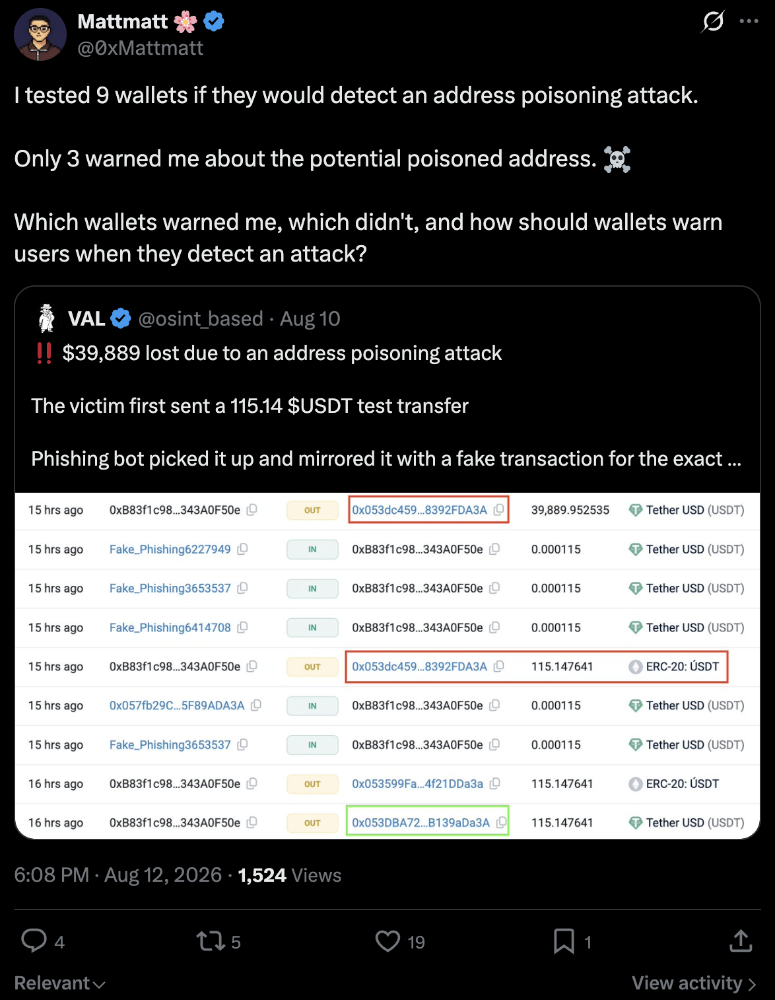

Quoting: https://x.com/0xMattmatt/status/2087481441458549107

A recent community test simulated an address poisoning attack across multiple wallets.

Address poisoning is just one example of a broader challenge: Scam Alerting.

How should wallets detect and warn users about scams?

A Walletbeat thread 🧵

---

At @Walletbeat, Scam Alerting is one of the attributes we assess under Security.

We look at how wallets warn users across different points of interaction.

---

Scam sites

Does the wallet warn users when they visit a known scam site?

We also consider the privacy implications of these checks: does the wallet leak the visited URL, IP address, or other identifying information?

---

Contract interactions

Does the wallet warn when users interact with:

→ A contract they've never used before?
→ A recently deployed contract?
→ A known scam contract?	

---

Sending funds

Does the wallet warn users when sending to:

→ A new recipient?
→ An address that resembles a previously used address?
→ An address outside their personal whitelist?

Address poisoning detection is one of the criteria we assess here.

---

Unlimited approvals

Does the wallet warn users before granting an unlimited token allowance?

An approval can give a spender ongoing access to a user's tokens, so users should understand what they're authorizing before signing.

---

Scam alerting isn't just about showing a warning.

We also consider privacy.

A wallet shouldn't have to sacrifice the user's IP address, Ethereum address, or browsing activity just to provide better scam protection.

---

These criteria help us objectively evaluate how wallets approach scam alerting.

Address poisoning is just one example.

The goal is to make wallet security protections more transparent and encourage the ecosystem to raise the bar.

---

Explore the full methodology at @Walletbeat.
[Link to Walletbeat]