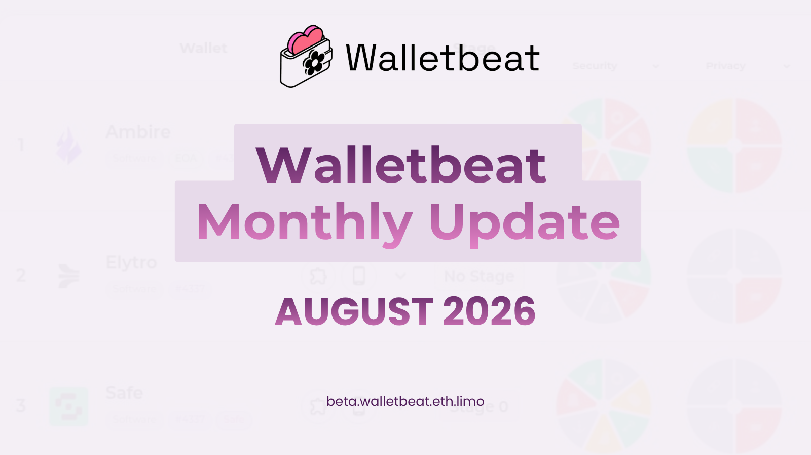
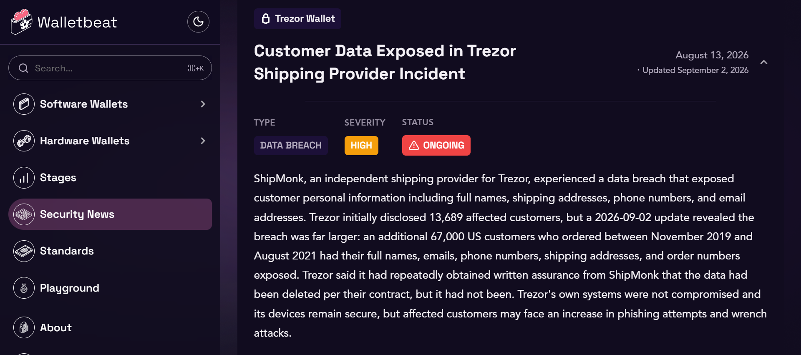
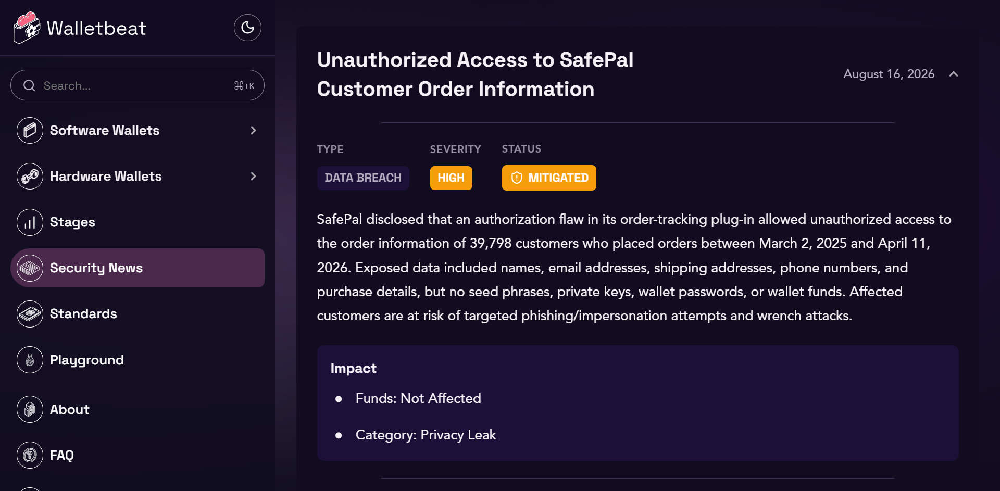
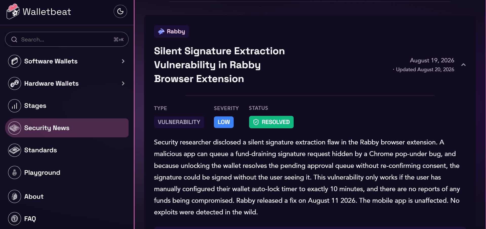
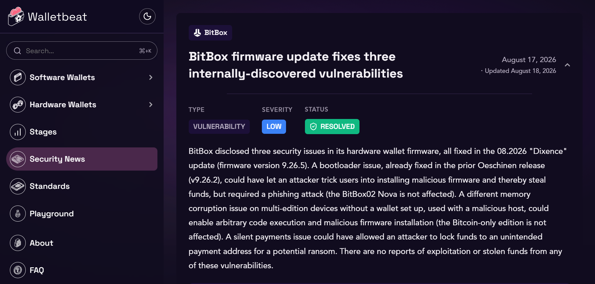

---
Tweet #1
Walletbeat monthly update is here!

Check out what happened across Walletbeat and the wallet ecosystem through August 👇
---
Tweet #2
Walletbeat contributor @0xmattmatt published a thread on how wallets handle unlimited token approvals, the pattern behind a ~$500K loss.

Ambire shipped an update flagging unlimited approvals for untrusted contracts, and credited Matt's research in the release.

Research: https://x.com/0xMattmatt/status/2089770635274928369

Ambire's reaction: https://x.com/ambire/status/2090759123273208256
---
Tweet #3
Walletbeat contributor @polymutex pointed out that treating IPFS gateways like @eth_limo as suspicious discourages wallets from adopting decentralized, censorship-resistant infrastructure.

@ambire agreed and dropped the flag 👇

https://x.com/borislavItskovv/status/2090563980549042476
https://x.com/ambire/status/2090483593407529375
---
Tweet #4
Process update: 

Wallet Security News now scores every incident on an objective severity scale. We went back and re-graded every past entry against it too, back to December's Trust Wallet supply chain incident.

https://beta.walletbeat.eth.limo/news/

---
Tweet #5
August's incidents, briefly:

- Trezor: shipping-partner data breach, disclosed at 13.7K customers, revised past 80K days later https://x.com/Trezor/status/2095807665603584085

---
Tweet #6
- SafePal: order data exposed for ~40K customers https://x.com/SafePal/status/2088937173139812792

---
Tweet #7
- Rabby: signing bug fixed before public disclosure, no funds lost https://x.com/v12sec/status/2090114226320977931
https://x.com/Rabby_io/status/2090269706087514615

---
Tweet #8
- BitBox: 3 vulnerabilities, found internally, already patched https://blog.bitbox.swiss/en/bitbox-08-2026-dixence-update/

---
Tweet #9:
Zerion's mobile app was marked "not a mobile app" in our data, a flag that quietly excused it from a security best practices check.

In fact, it does have one. The source code is not public. We’ve corrected our own data to reflect this.

https://github.com/walletbeat/walletbeat/commit/127c3193d1ec5f9ef119cdd6f0f6364e51164543
---
Tweet #10:
Deeper coverage this month:  

Zerion's licensing, repository controls, and monetization sourced and split by app variant: https://github.com/walletbeat/walletbeat/commit/681d99302f6ceb595586ae224fab24c475e8addb

Rabby's mobile security best practices independently assessed for the first time: https://github.com/walletbeat/walletbeat/commit/adf59a975b1651bfb0fcad14816b47f0b1aea4ac

Phantom's rating expanded from an early stub to real coverage across security, privacy, and self-sovereignty: https://github.com/walletbeat/walletbeat/commits/beta/data/software-wallets/phantom.ts

---
Tweet #11:
New content produced: 

How the Coldcard MK3 seed generation bug worked: https://x.com/walletbeat/status/2085075338129002939

How address poisoning tricks users into paying the wrong address twice: 
https://x.com/walletbeat/status/2087739731530715346
https://x.com/0xMattmatt/status/2087481441458549107 

Unlimited approvals breakdown:
https://x.com/walletbeat/status/2092284824023445874
---
Tweet #12:
Behind the scenes: 

An agent-friendly data collection CLI: https://github.com/walletbeat/walletbeat/commit/ee22a4f19fd71af885127c30fee16a1792f36d5b

A Coinspect-to-Walletbeat wallet ID mapping to cross-reference published audits against our own data: https://github.com/walletbeat/walletbeat/pull/735

---
Tweet #13:
We submitted four proposals for @EFDevcon:

A talk on wallets as CROPS' last-mile problem: https://github.com/walletbeat/walletbeat/blob/beta/resources/talks/2026-11-devcon/walletbeat-launch-crops-last-mile/proposal.md

A workshop teaching anyone to contribute verified wallet data: https://github.com/walletbeat/walletbeat/blob/beta/resources/talks/2026-11-devcon/walletbeat-contribute-workshop/proposal.md 

Lightning talks on supply chain security and what should come after clear signing:
https://github.com/walletbeat/walletbeat/blob/beta/resources/talks/2026-11-devcon/wallet-software-supply-chain-security/proposal.md

https://github.com/walletbeat/walletbeat/blob/beta/resources/talks/2026-11-devcon/beyond-clear-signing/proposal.md
---
Tweet #14:
On funding: 

We also submitted our application to the @EF_ESP. Walletbeat takes no funding from wallets, by design, so grants like this are what keep the lights on.
---
Tweet #15:
Wallets are one of the most critical layers of the crypto ecosystem. We keep watching 🫡

Until next month! 🌸

---