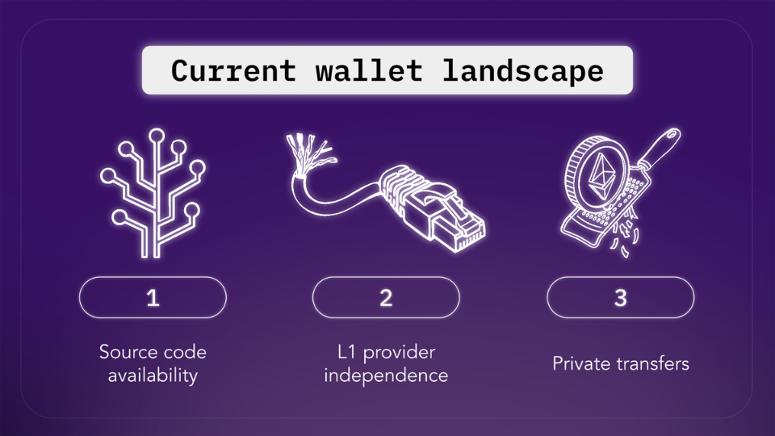
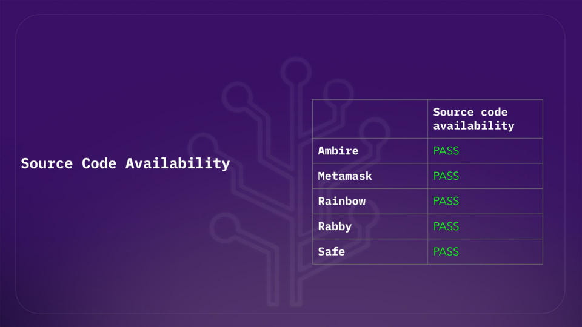
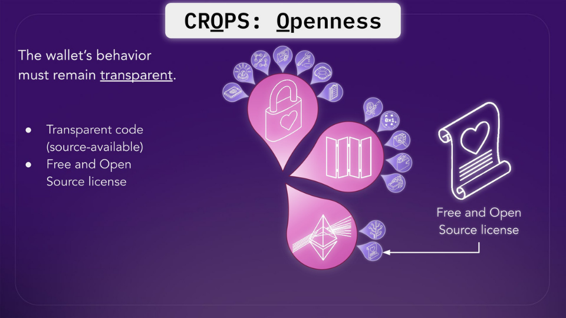
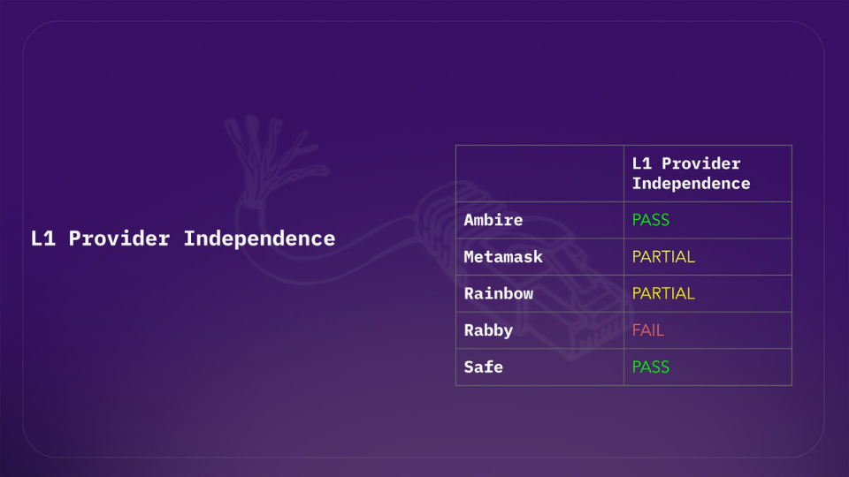
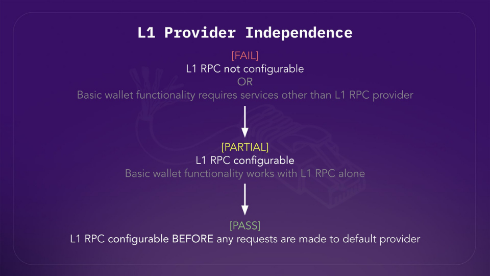
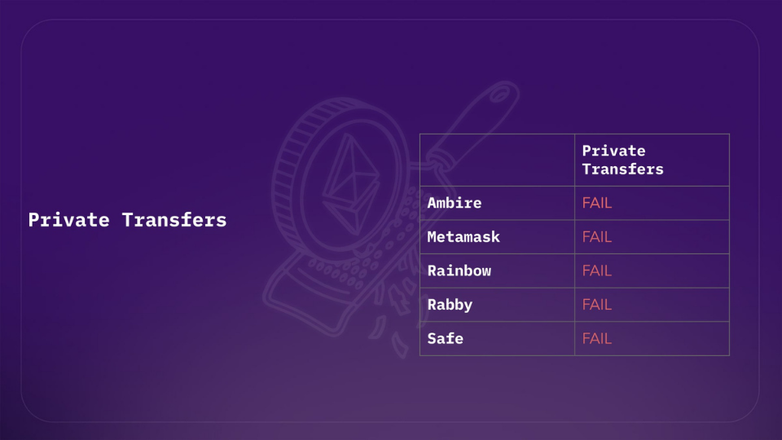
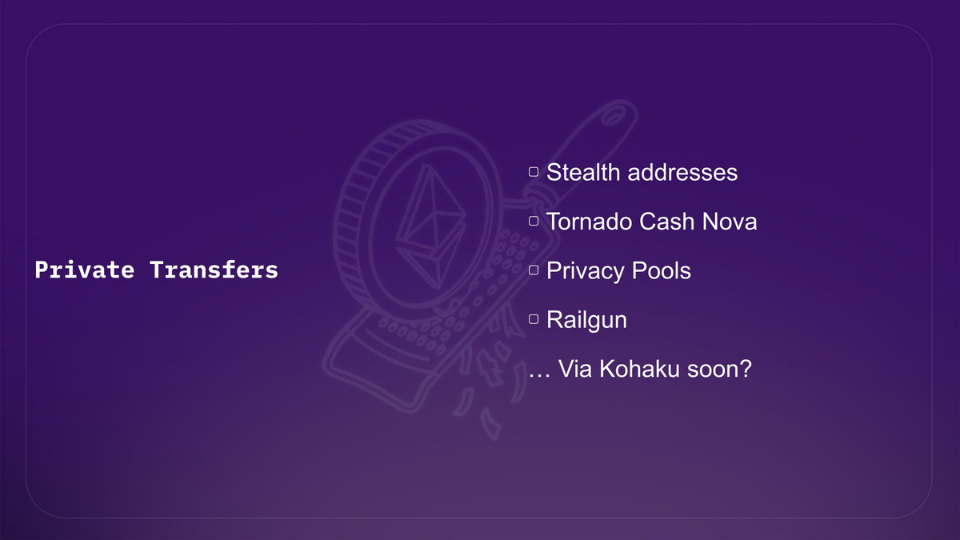
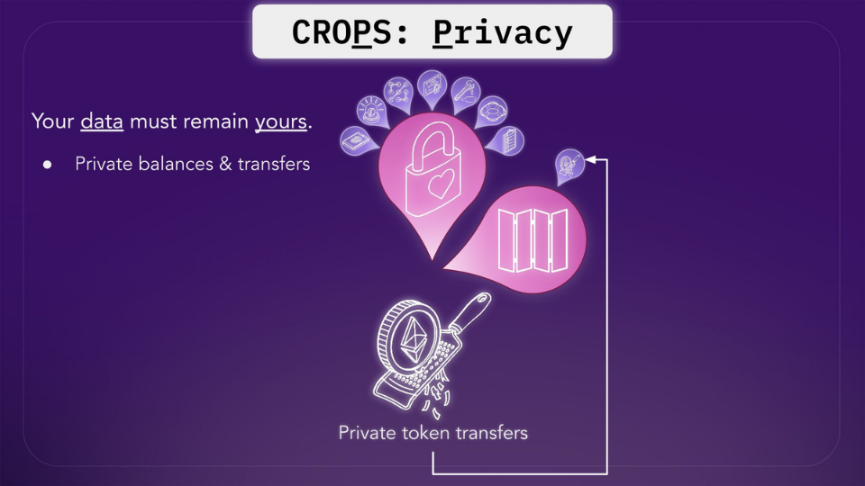
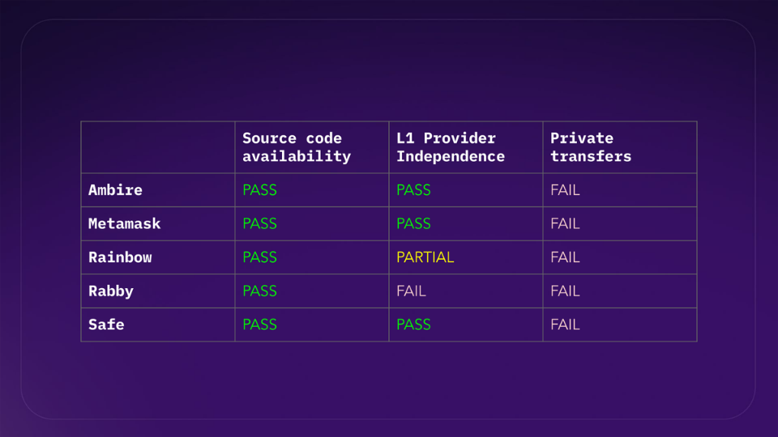
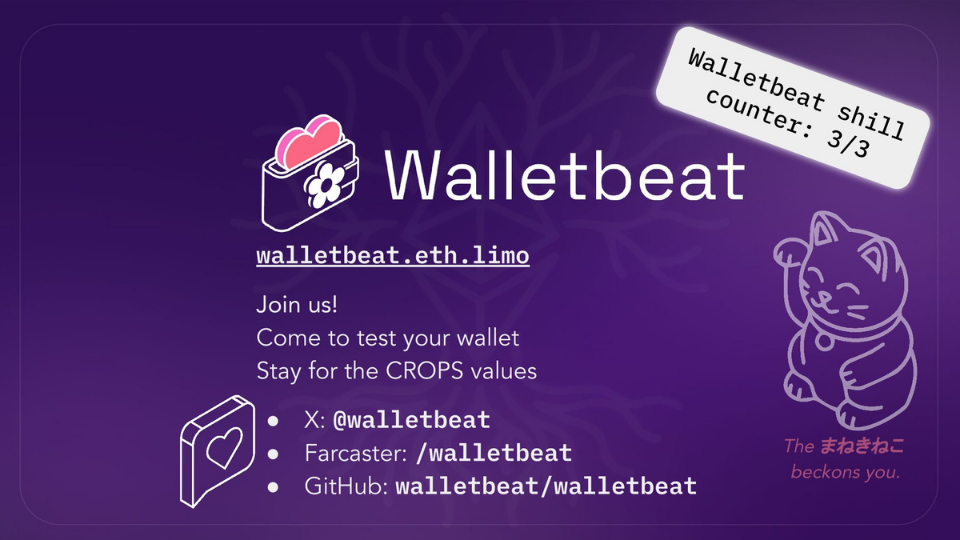

---
At Walletbeat, we use a framework to evaluate wallets across five dimensions: Security, Privacy, Transparency, Ecosystem Alignment, and Self-sovereignty. 

The same exact values that CROPS stands for.

Now, let's take a look at how these attributes are rated, based on different wallets 🧵

---

For this comparison, we'll be analyzing three attributes:
- Source code availability
- L1 provider independence
- Private transfers

We'll be looking at wallets such as @ambire, @MetaMask, @rainbowdotme, @Rabby_io and @safe.
---

🌸 Source Code Availability:
Wallets are assessed based whether the source code is available to the public. This allows anyone (including Walletbeat, as well as security auditors) to inspect what the wallet is doing.

In this area the ecosystem is doing relatively well. Most of the Ethereum wallets right now are open source projects, and therefore source-available, so they all pass.

---

On a related note, Walletbeat also looks at a wallet's source code license: is it FOSS?
FOSS (Free & Open Source Software) licensing allows a software project's source code to be freely used, modified and distributed. 

This enables better collaboration, more transparency into the software development practices that go into the project, and more guarantees for wallet users to fork, reuse, and remix the wallet's code.

In short, it turns software projects into public goods.

---

🌸 L1 Provider Independence:
This is the attribute that allows users to configure their own L1 RPC provider before doing any requests.

As you can see in our results, it's a mix of PASS, PARTIAL, and FAIL. 

Most wallets today have a partial rating, meaning that while they allow configurable RPCs, it would only be after a certain amount of requests made through the wallet's default provider 😣

---

For a wallet to pass our L1 Provider Independence attribute, the user should be able to configure the L1 RPC provider before any requests are made to the default provider.

---

Why does this matter?
Running your own node gives you several important benefits, like privacy, integrity, censorship resistance and no downtime.

Wallets must allow users to use a self-hosted node for these benefits to be realized in practice, and must not critically depend on external services to perform basic L1 interactions such as balance lookups and sending tokens.

Blockchains' censorship resistance properties relies on disintermediation. Without the ability to use their own Ethereum nodes, users are forced to rely on intermediaries for interacting with the chain.

---

🌸 Private Transfers:
Can you send and receive tokens without revealing your transaction history to others? Walletbeat looks at whether wallets let users send, receive, and spend tokens privately by default.

This is an area where the ecosystem is a bit lacking. Most of the wallets today don't support private transfers, because Ethereum itself is transparent by default. 

Data posted on public blockchains like Ethereum is publicly available to everyone. This means that anyone can see your transaction history.

---

But nevertheless, it's still possible. Many privacy solutions have emerged to solve this problem: stealth addresses, @TornadoCash, @RAILGUN_Project, @0xprivacypools make it possible. And hopefully, via Kohaku soon.

---

However, to be actually usable by users, these solutions must be tightly integrated in wallets and easy to use.

Why should I care?
You would not voluntarily post your bank statements or private purchase history online, yet this is what happens by default when transacting on public blockchains.

Without private token transfers, the user's Ethereum activity will be publicly and forever stored for the world to see. This would be the equivalent of a financial panopticon.

---

And with all of that being described, this framework to measure CROPS in wallets is actually existing within Walletbeat. 

The role of Walletbeat is to push the Ethereum wallet ecosystem forward, because Ethereum values only matter if users actually experience them.

---

Please visit our website to see where we currently are 🌸 Let's keep pushing CROPS in wallets. 

https://beta.walletbeat.eth.limo/about/

