---
Security is about ensuring that your account remains yours.

So how can wallets embody Security?

A Walletbeat thread 🧵

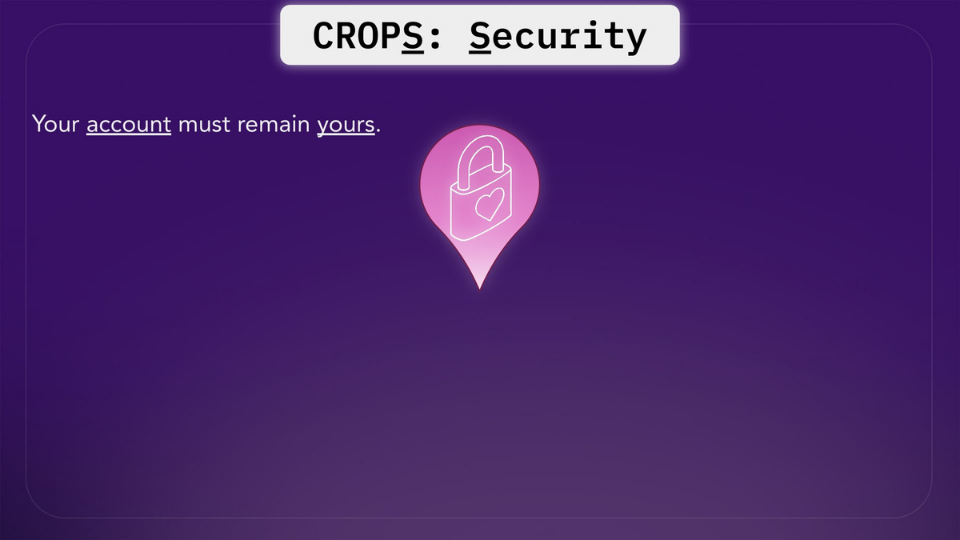

---

Transaction legibility 🫆

This means that as a user you should be able to understand what the transaction you're about to sign is going to do, before you sign it. 

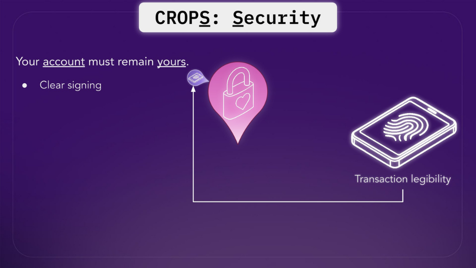
---

Why does this matter?
This is how we avoid situations like the ByBit Hack, which was the largest computer hack in history, as defined by amount of lost funds.

The @ethereumfndn has launched the Clear Signing Initiative as a result of this hack 👇

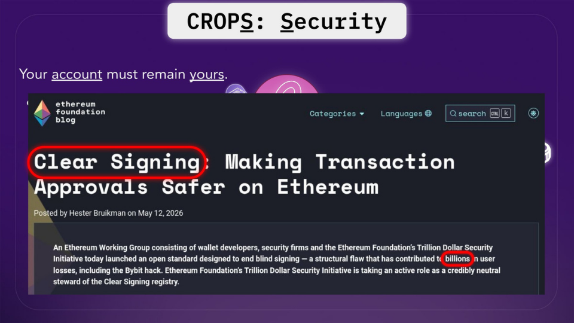
---

Scam Alerting 🚨

Wallets have a responsability for alerting the users if they'are about to do something that looks deceitful, through a variety of heuristics. 

Does the wallet warn the user about potential scams?

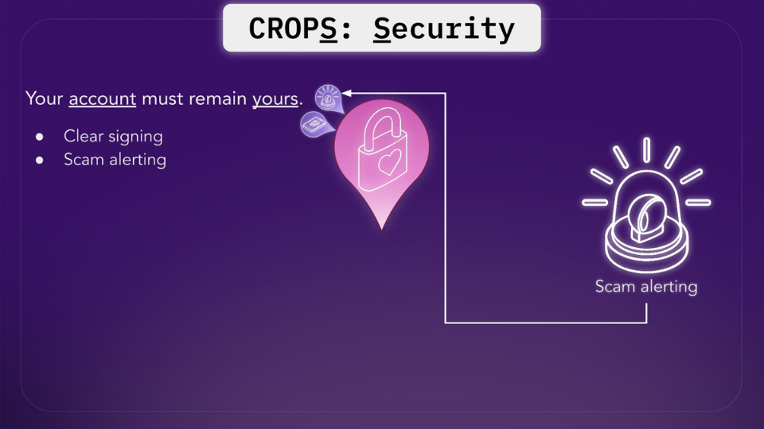
---

Why should you care?
Transactions in Ethereum are very difficult to reverse, and there is no shortage of scams. 

Users need to be warned about scam sites, address poisoning, known scam contracts, unlimited token approvals, recently deployed contracts, etc.

For a full breakdown, check out our thread 🧵
https://x.com/walletbeat/status/2087739731530715346
---

Hardware Wallet Support 

You also need to be able to air gap your keys. Does the wallet support connecting to hardware wallets? 

Hardware wallets are physical devices that store a user's private keys offline, providing an additional layer of security against online threats. 

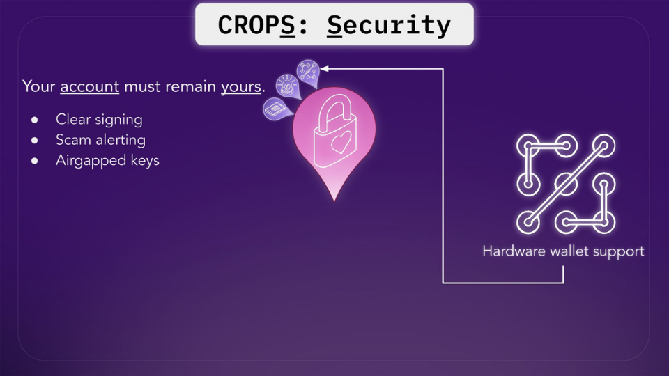
---

Why this matters?
By keeping private keys isolated from internet-connected devices, hardware wallets protect users from malware, phishing attacks, and other security vulnerabilities that could compromise their funds.

When a software wallet supports hardware wallets, users can enjoy the convenience and features of the software wallet while maintaining the security benefits of keeping their private keys offline. 

This combination offers the best of both worlds: a user-friendly interface with enhanced security.

---

Security Audits 

Has the wallet's source code been been reviewed by security auditors, and does the wallet maintain an active bug bounty program?

Wallets are high-stakes pieces of software that deal with sensitive user data and funds. 

Industry best practices involve regularly submitting the wallet's source code for audit by an independent security auditor. 

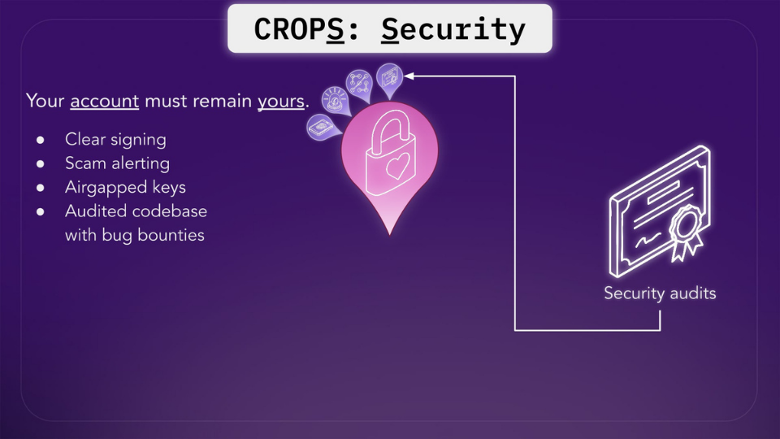
---

Bug Bounties
Does the wallet maintain an active bug bounty program?

They incentivize security researchers to responsibly discover and disclose vulnerabilities, rather than exploit them.

Additionally, wallets should provide upgrade paths for users when critical security issues are discovered.

---

Duress Resistance 🔧

Duress resistance is your wallet's ability to protect you under physical threat.

A separate credential (a duress PIN or passphrase) triggers a protective action when entered.

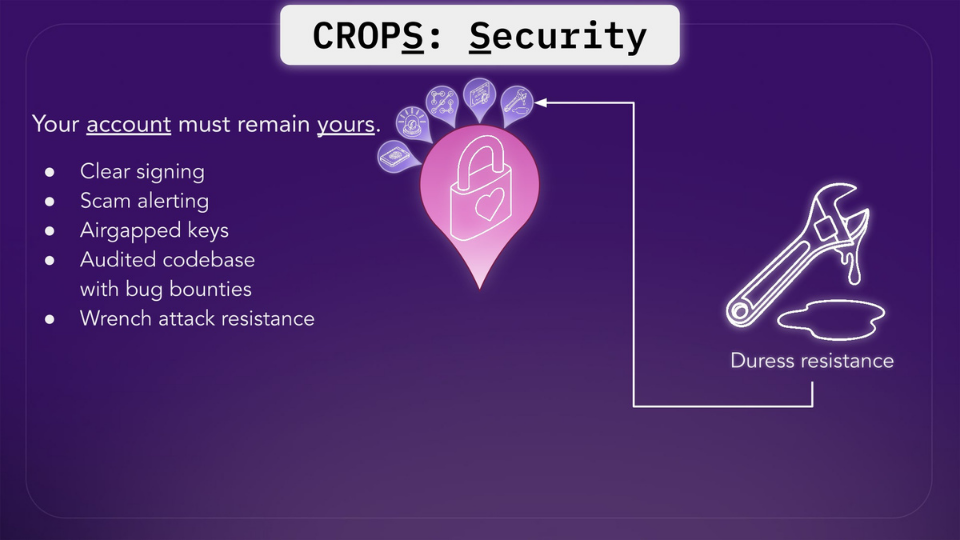
---

Why this matters?
No amount of cryptographic security can stop an attacker standing next to you with a weapon.

This is a different threat model, and most wallets don't account for it.

This attribute currently applies to mobile wallets only, as they are the ones most likely to be involved in such scenarios.

---

Account recovery 🛟

How easy does the wallet make it to recover your account?

Self-custody is difficult and complicated for most normal users, relative to typical web2 accounts which often feature easy account recovery features. 

Some users avoid self-custody due to this concern.

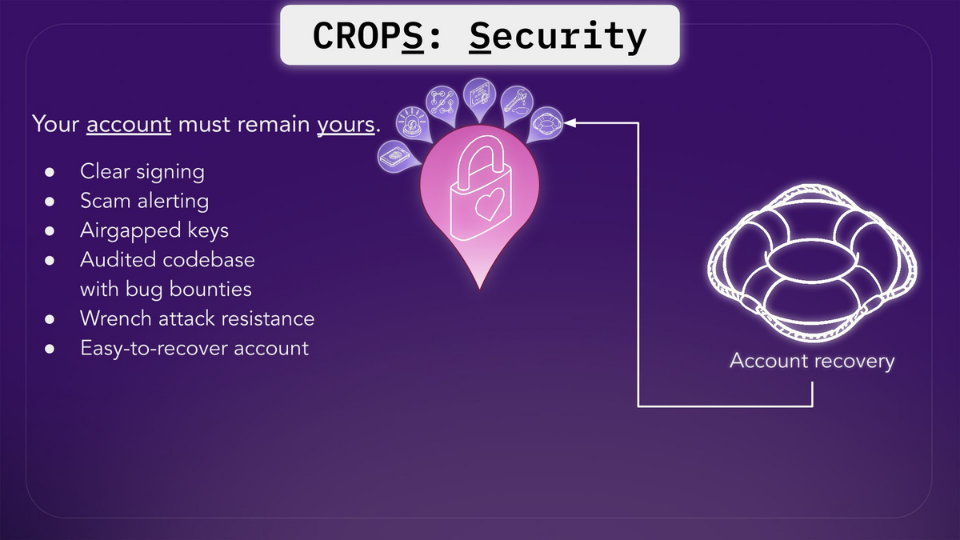
---

Why should you care?
Social recovery helps make self-custody safe and practical for everyday users. Properly implemented, this keeps users safer while still providing the self-sovereignty benefits of self-custody.

However, recovery methods can become inaccessible over time.

Wallets can address this by periodically asking users to verify that their recovery methods are still accessible, catching such problems while there is still time to fix them.

---

Security Best Practices 📋

They are the fundamentals that determine whether your keys are actually safe.

This attribute evaluates wallets across several areas:
Key storage, secure randomness, key generation location, app permissions.

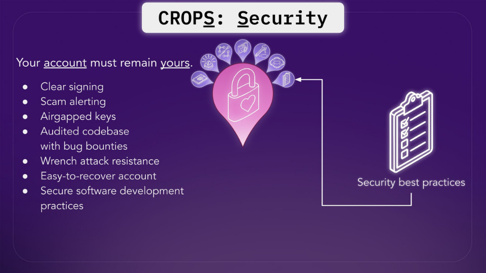
---

Why this matters?
Key storage: are your private keys stored in a hardware security module, encrypted at rest, or sitting in plaintext?

Secure randomness: does key generation use a cryptographically secure source, or a weaker source of randomness?

Key generation location: are your keys generated on your device, or on external servers you don't control?

App permissions: does the wallet request only what it needs, or does it over-permission itself?

https://x.com/walletbeat/status/2047723760523092313
---

Walletbeat is a useful resource for evaluating wallet security. 

Security is one of the five categories we assess.

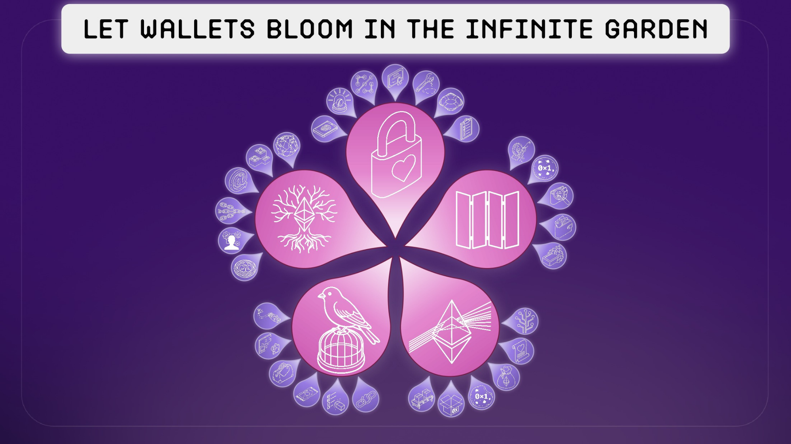
---

Check your own wallet on Walletbeat's Security ratings 👀

http://beta.walletbeat.eth.limo

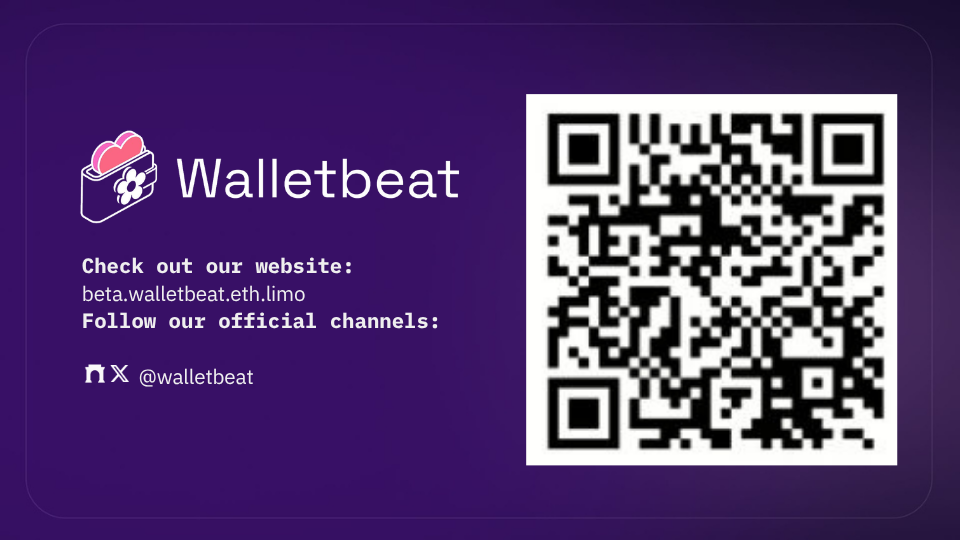