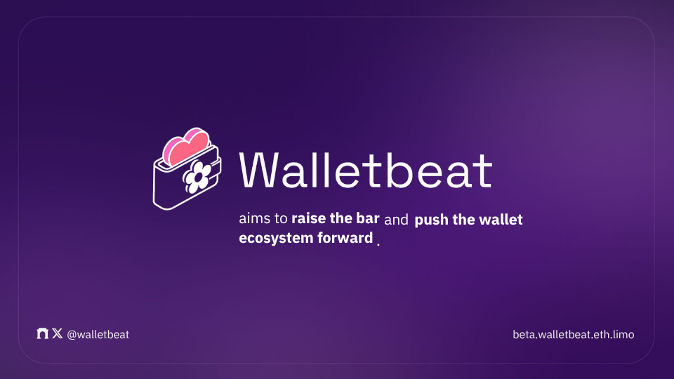

---
At it's core, Security is about ensuring that your account remains yours.

So how can wallets embody Security?

A Walletbeat thread 🧵

---

One way in which they can is Transaction legibility 🫆

This means that as a user you should be able to understand what the transaction you're about to sign is going to do, before you sign it. 

This is how we avoid situations like the ByBit Hack, which was the largest computer hack in History, as defined by amount of lost funds.

The @ethereumfndn has launched the Clear Signing Initiative as a result of this hack 👇

---

Scam Alerting 🚨

The wallet has a responsability for alerting the users if they're about to do something that looks deceitful. Does the wallet warn the user about potential scams?

Why should I care?
Transactions in Ethereum are very difficult to reverse, and there is no shortage of scams. 

Wallets have a role to play in helping users avoid known scams ahead of the user making the transaction. 

This is especially true for unlimited token approvals: if the approved contract is later exploited, attackers can use that approval to drain the funds a user approved, a class of exploit that has stolen over $362M since 2020.

---

Hardware Wallet Support 

You also need, as a user, to be able to air gap your keys. Does the wallet support connecting to hardware wallets? 

Why does this matter?
Hardware wallets are physical devices that store a user's private keys offline, providing an additional layer of security against online threats. 

By keeping private keys isolated from internet-connected devices, hardware wallets protect users from malware, phishing attacks, and other security vulnerabilities that could compromise their funds.

When a software wallet supports hardware wallets, users can enjoy the convenience and features of the software wallet while maintaining the security benefits of keeping their private keys offline. 

This combination offers the best of both worlds: a user-friendly interface with enhanced security.

---

Security Audits & Bounties 

Has the wallet's source code been been reviewed by security auditors, and does the wallet maintain an active bug bounty program?

Why should I care?
Wallets are high-stakes pieces of software that deal with sensitive user data and funds. 

To ensure that their code is secure, industry best practices involve regularly submitting the wallet's source code for audit by an independent security auditor. 

They report their findings to the wallet's development team for consideration, pointing out both flaws and potential security improvements.

However, even audited software is not free of vulnerabilities. Bug bounty programs incentivize security researchers to responsibly discover and disclose vulnerabilities, rather than exploit them.

Additionally, wallets should provide upgrade paths for users when critical security issues are discovered, so that fixes actually reach existing users.

---

Duress Resistance 🔧

Duress resistance is your wallet's ability to protect you under physical threat.

A separate credential (a duress PIN or passphrase) triggers a protective action when entered.

Why this matters?
No amount of cryptographic security can stop an attacker standing next to you with a weapon.

This is a different threat model, and most wallets don't account for it.

This attribute currently applies to mobile wallets only, as they are the ones most likely to be involved in such scenarios.

---

Account recovery 🛟

What if you forget your seed phrase? How easy does the wallet make it to recover your account?

Why should you care?
Self-custody is difficult and complicated for most normal users, relative to typical web2 accounts which often feature easy account recovery features. 

Moreover, losing one's seed phrase can be a devastating and irrecoverable financial loss. Some users avoid self-custody due to this concern.

Guardian-based recovery (also known as "Social recovery") helps make self-custody safe and practical for everyday users. Properly implemented, this keeps users safer while still providing the self-sovereignty benefits of self-custody in the day-to-day.

However, recovery methods can themselves silently become inaccessible over time.

Wallets can address this by periodically asking users to verify that their recovery methods are still accessible, catching such problems while there is still time to fix them.

---

Security Best Practices 📋

They are the fundamentals that determine whether your keys are actually safe, or just assumed that it is.

This attribute evaluates wallets across several areas:
Key storage, secure randomness, key generation location, app permissions.

Why this matters?
A wallet can look polished and still have poor security fundamentals.
These aren't advanced features. They're the fundamentals.
Getting these right is the foundation everything else builds on.

Hardware wallets are exempt from this attribute because they handle key security through dedicated physical security mechanisms.

---

Walletbeat exists to push wallets toward better security, privacy, and self-sovereignty.

When wallets compete on these metrics, users win.

---

Check your wallet on Walletbeat's Security ratings 👀

http://beta.walletbeat.eth.limo

