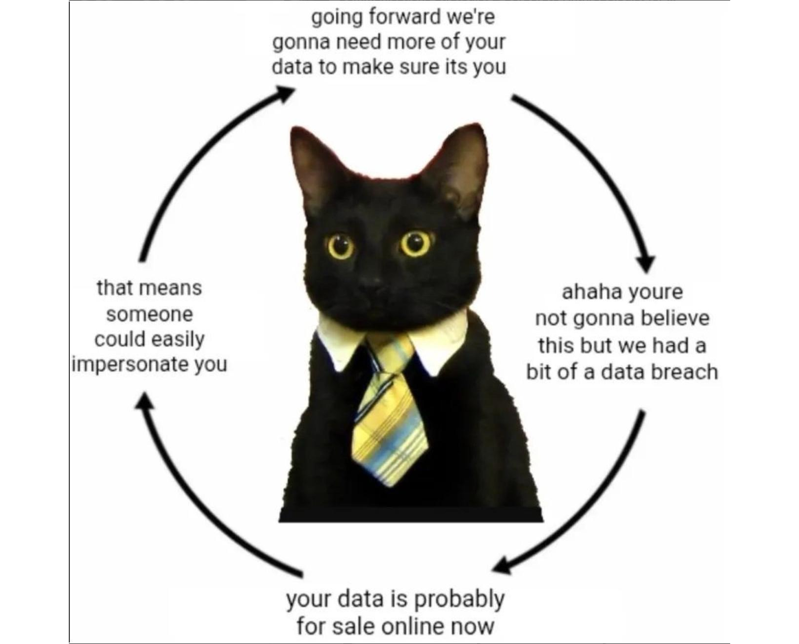

---
The KYC loop, illustrated. 

Every "we need more data to verify it's you" is also a bigger prize the next time there's a breach. 

Less collected is less exposed.

---

Wallets must collect no more user data than a web browser does by default.

They handle sensitive financial data. 

Collecting excessive user data creates unnecessary privacy risks and undermines user trust.
---

Check your own wallet on Walletbeat's ratings 👀

http://beta.walletbeat.eth.limo

