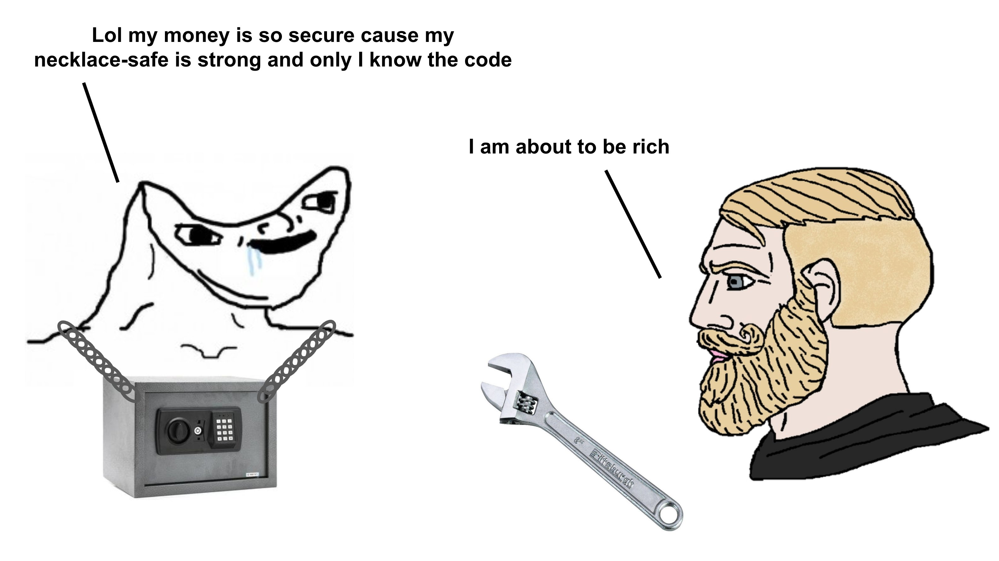

---

A wallet must protect users against physical coercion and unauthorized access.

It should provide mechanisms such as a duress PIN or decoy wallet to protect users under coercion, limiting the effectiveness of physical theft or forced access.

---
At Walletbeat, Duress Resistance is one of the attributes we assess under Security.

We look at your wallet's ability to protect you under physical threat.

Explore the full criteria at our thread 🧵

https://x.com/walletbeat/status/2042570101338313070

---

Where will you store your money? Make an informed decision!

Check your wallet on Walletbeat's ratings 

http://beta.walletbeat.eth.limo

