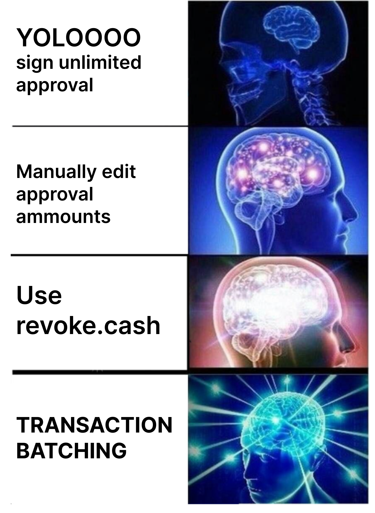

---

Wallets must support atomic batched transactions.

Batched transactions through the WalletCall API enable better UX for common DeFi workflows, such as token approvals followed by a DeFi operation. 

Atomic batched transactions make such batched transactions safer and easier to understand for the user, as well as enabling advanced DeFi use-cases.

---

At Walletbeat, we use unlimited token approvals as part of our evaluation framework to test how wallets warn users about potentially dangerous transactions.

Unlimited approvals don't have to be the norm anymore. Let's change that 👇

https://x.com/walletbeat/status/2087739731530715346
---

We need more wallets to stand for the `S` in CROPS. 

Test your wallets here!

http://beta.walletbeat.eth.limo

