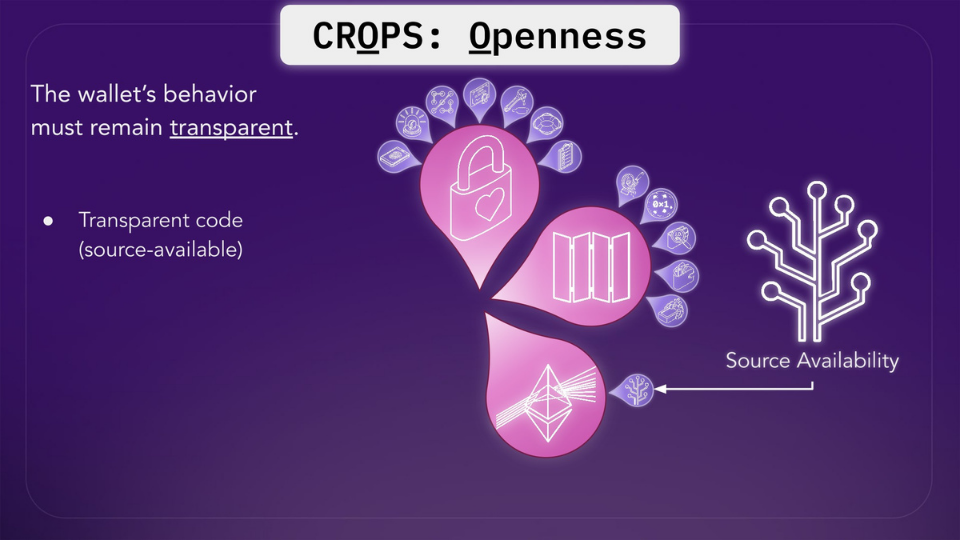
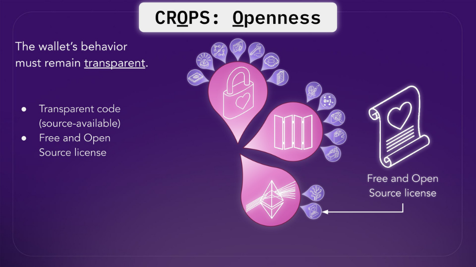
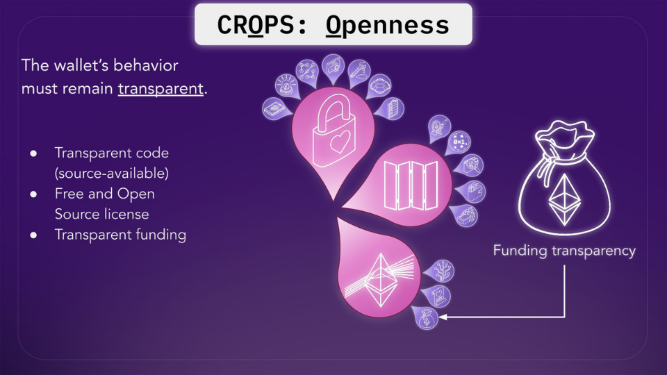
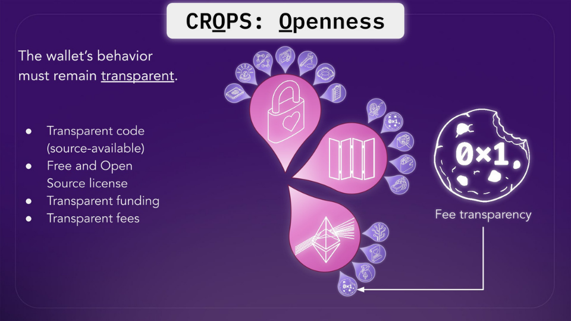
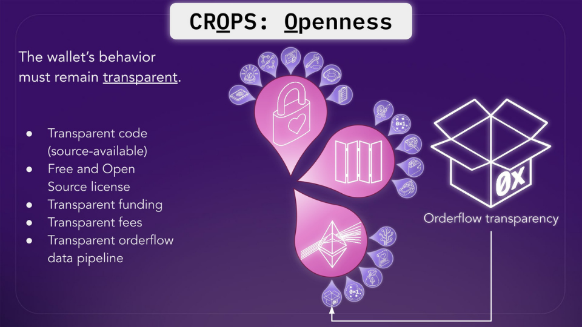
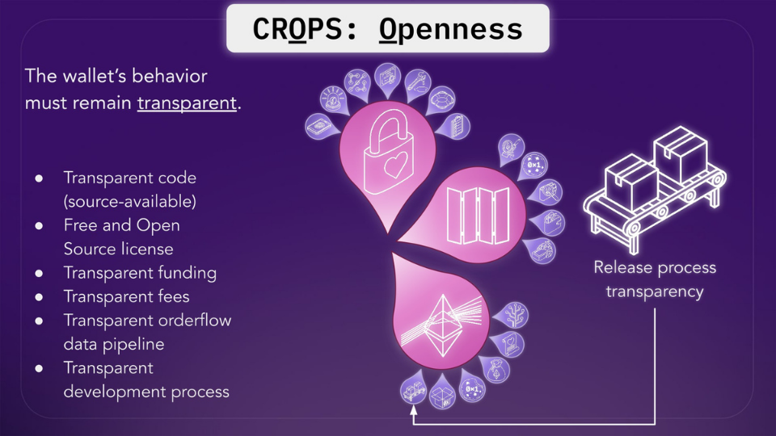

Openness, as it relates to wallets, means that the way in which the wallet behaves must be transparent to you as the user.

What does that mean in practice?

Here's how Walletbeat evaluates transparency, and why these attributes matter.

---
Source Availability 🍝

Is the wallet's source code publicly available? You should be able to read the code of the wallet and understand what it does.

Source availability allows anyone (including Walletbeat, as well as security auditors) to inspect what the wallet is doing. This is important for security, auditability and build reproductibility.

---
Free and Open Source Licensing 📜

Is the wallet's source code free and open source licensed? 

If so, it means that you have the freedom to mix, to share, to adapt that software. So it's important for code reuse and feasible to transfer maintainership if the team walks away.

FOSS licensing also allows better collaboration, more transparency into the software development practices that go into the project, and allows security researchers to more easily identify and report security vulnerabilities.

---
Funding Transparency 💰

Is it clear how the wallet's development is funded? 

There is probably a wallet development entity behind the wallet you're using. And it's also important that the way that entity is funded is transparent to you, because this lets you ensure that their incentives are aligned with you, as a wallet user.

A reliable and transparent source of funding is important to make sure its development is going to be sustainable and to make sure that the wallet doesn't get tempted to sell your personal data, because they need more money.

---
Fee Transparency 💸

Does the wallet clearly display all transaction fees and their purpose? 

This is not just in transactions but also in built-in swaps, in bridges, and all that. Is it clear what you are actually paying?

The fees charged by the wallet must be made transparent to the user at all times.

---
Orderflow Transparency 🗺️

What happens to the orderflow data that you're creating as you do transactions? Does the wallet transparently disclose how it monetizes your transaction data? 

Wallets can skim some value off of the MEV, and they should be transparent about what they do. 

This is very similar to the way that Payment for Order Flow disclosures works in TradFi. They have to disclose this, so wallets should too.

---
Release Process 📦

Can users trust that the wallet's releases are built and distributed safely? 

The wallet release process must follow safety best practices.

 A well-defined release process with artifact signing, reproducible builds, and dependency locking reduces supply chain attack risk.

---
There are a lot to care about in wallets. 

If you want to learn more about any one of them, you can go on any Walletbeat wallet page and look at the methodology and the rationale behind the attributes 👇

http://beta.walletbeat.eth.limo

