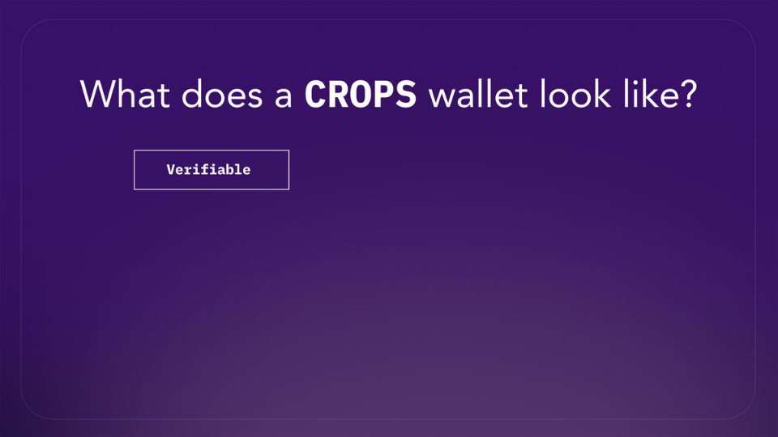
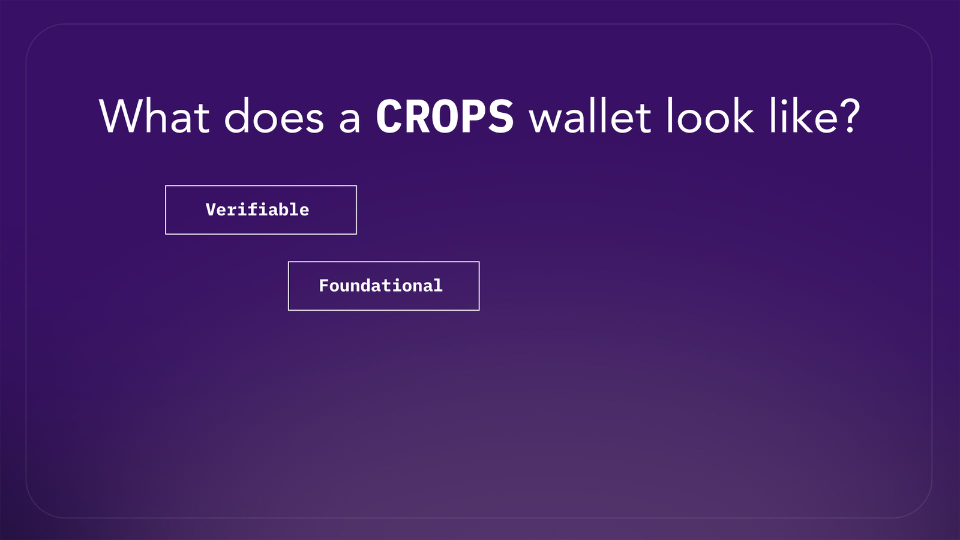
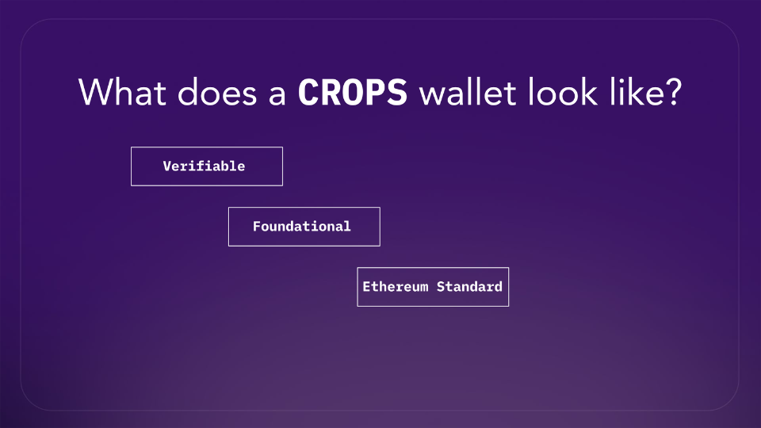
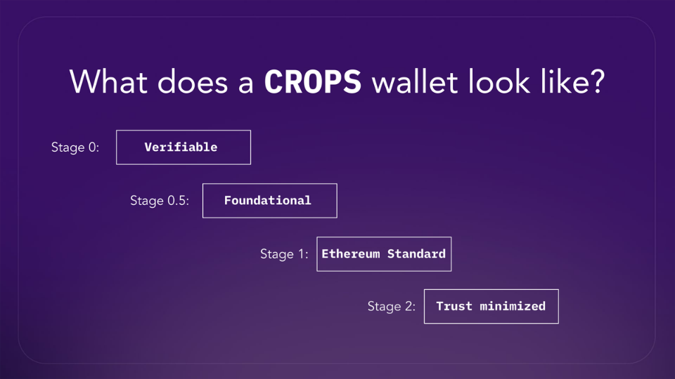
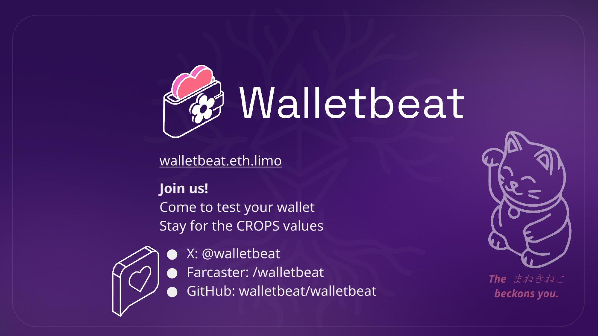

Walletbeat is a rating system for Ethereum wallets. So we use a framework to evaluate wallets across five dimensions: Security, Privacy, Transparency, Ecosystem Alignment and Self-sovereignty. The same exact values that CROPS stands for.

These are a lot of dimentions to care about wallets. As a wallet development team, this give you a lot of targets to hit: Where do you start? How do you make progress? How do you make sense of it all? This is where the Stage System comes in. 
 

### Stage Evaluation Framework for Ethereum Wallets  

We’ve introduced Wallet Stage Definitions to map a wallet's progression toward self-sovereignty. It's a cross-cutting rating system across all of the five attribute groups. What we have here is not just a checklist, it's a maturity framework: Stage 0, Stage 0.5, Stage 1 and Stage 2. 

Walletbeat took inspiration from L2BEAT's Rollup Maturity Framework. We introduce the same Stage Evaluation Framework but for Ethereum Wallets.
Stages describe the milestones Ethereum wallets should work towards. Each stage builds on the previous, forming a roadmap for wallet teams to follow.

We wanted to answer the question: What does a CROPS wallet look like?

## Stage 0: Verifiable
Users should at least be able to verify the wallets they're using.
- Source Code Availability 🍝
The source code must be publicly available so that it can be reviewed by the public.

## Stage 0.5: Foundational
Wallets should also implement the foundations of a proper Ethereum wallet. 

The wallet provides basic security protections for its users:
- Hardware Wallet Support
Supporting hardware wallets lets users keep their private keys offline, adding a critical layer of security.

- Transaction Legibility 🫆
Users must be able to see key transaction details (amount, recipient, chain, fees) before signing to understand the transaction they are about to do.

- Basic Authentication
Without a lock screen, anyone who picks up a device can immediately access and transfer funds. Basic authentication is the minimum bar for protecting users against physical theft or unauthorized access.

- Basic Account Recovery Assurance
Recovery methods can silently become inaccessible over time, for example a seed phrase becoming unreadable. Periodic check-ups catch this early, rather than leaving users to discover the problem only when they actually need to recover their account. 

## Stage 1: Ethereum Standard
After that, a wallet can now move on to becoming an Ethereum Standard wallet. A wallet that follows ecosystem standards, embraces interoperability, and adopts ecosystem practices.

The wallet provides a basic level of security:

- Security Audits
This provides a level of assurance about the software security practices of the wallet developer.

- Hardware Wallet Interoperability
Hardware wallets keep private keys isolated on dedicated, purpose-built devices, and direct support for multiple manufacturers ensures users are not locked into a single hardware vendor and can freely choose the device that best fits their security needs.

- Scam Alerting 🚨
Wallets should alert users about known scams before transactions are made, helping prevent irreversible losses. Transaction legibility (Stage 0.5) is a prerequisite for meaningful scam alerting.

- Standard Security Practices
Standard security practices, such as storing keys in a secure enclave and requesting minimal permissions, protect users from key extraction attacks and malicious apps. These are baseline implementation requirements for a wallet that takes security seriously.

- Account Recovery 🛟
The wallet must implement guardian-based account recovery that lets users recover their account in all likely catastrophic scenarios, and must periodically prompt users to verify that their account recovery methods are still accessible

The wallet offers a minimal level of privacy to its users:

- Private Transfers
Without private token transfers, the user's Ethereum activity will be publicly and forever stored for the world to see. This would be the equivalent of a financial panopticon.

- Wallet Address Privacy 🔍
Your wallet address is unique and permanent, which makes it easy to track your activity. At minimum, wallets must not link your wallet address to personally identifying data such as your name, email, phone number, or account credentials. Linkage to IP address or pseudonyms is tolerated at this stage.

- Multi-Address Privacy 👛
You probably have more than one wallet address configured in your wallet, which you use for different purposes and perhaps as different identities. These wallet addresses all belong to you, but you would rather keep that fact private. It is therefore important to use a wallet that does not reveal that fact.

The wallet does not lock the user in and lets the user remain in full control of their account: 
- Account Unruggability 
No external party must be able to take over the account without the user's consent.
True self-sovereignty requires that neither the wallet developer nor any external service can unilaterally take over the user's account.

- Account Portability 💼
The wallet must allow users to freely export their account to another wallet.
To avoid wallet lock-in, users must be able to export their account information and import it in another wallet.

- Support Own Node
Blockchains' censorship resistance properties relies on disintermediation. Without the ability to use their own Ethereum nodes, users are forced to rely on intermediaries for interacting with the chain.

- Outstanding Approvals (ERC-20)
Outstanding token approvals are a major risk vector, they allow contracts to drain user funds even long after initial interaction. Being able to inspect (and ideally revoke) ERC-20 approvals is the baseline for protecting users from this risk.

The wallet's development process and internal workings are transparent to the user:

- Free and Open Source Licensing 📜
The wallet must be licensed under a Free and Open Source Software (FOSS) license. FOSS licensing allows better collaboration, more transparency into the software development practices that go into the project, and allows security researchers to more easily identify and report security vulnerabilities.

The wallet is aligned with basic Ethereum ecosystem best practices for usability:
- Address Resolution 📧
The wallet must allow users to send funds to human-readable Ethereum addresses (e.g. ENS). This improves the user experience of Ethereum and its layer 2 ecosystem while reducing the potential for mistakes when sending funds.

- Browser Integration 🌐
The wallet must comply with web browser integration standards. This ensures compatibility across wallets, and ensures that the Ethereum wallet ecosystem remains competitive thanks to interoperability.

## Stage 2: Trust Minimized
The wallet has minimized trust assumptions on its own infrastructure while maximizing user privacy and sovereignty.

The wallet provides a strong level of security:
- Chain Verification 🔗
Much like browsers use HTTPS to provide integrity when doing online purchases, wallets should verify the integrity of the chain when performing transactions.

- Bug Bounty Program 🐛
The wallet must be part of a funded Bug Bounty program.
This aligns incentives for security exploits to be reported to the wallet developers, rather than exploited.

- Duress Resistance 🔧
A wallet should provide mechanisms such as a duress PIN or decoy wallet to protect users under coercion, limiting the effectiveness of physical theft or forced access.

- Impact Mitigation
The wallet must let users set self-imposed limits to mitigate damage from unauthorized access.
Spending rate-limits, high-value spend timelocks, or multiparty authorization for large transactions limit the blast radius of a compromised wallet.

The wallet collects no more information about its users by default than a web browser does:
- Minimal Data Collection 🧼
The wallet must collect no more user data than a web browser does by default.
Wallets handle sensitive financial data. Collecting excessive user data creates unnecessary privacy risks and undermines user trust.

- Full Wallet Address Privacy 🔍
Wallet addresses must not be correlatable with any user information, including IP address.
At Stage 2, wallets must go beyond avoiding sensitive personal data linkage. Even an IP address is enough to de-anonymize a user across sessions and devices. All network requests carrying the wallet address must be proxied or otherwise decoupled from the user's network identity.

- App Isolation 🍪
The wallet must offer app-specific accounts by default when connecting to apps.
Much like websites cannot query a browser's history from other websites by default, apps should not be able to correlate a user's activity across other apps by default. Wallets must offer per-app accounts as the default behavior when connecting to apps, and remember the addresses last used for a given app.

The wallet must not lock the user in and lets the user remain in full control of their account:
- Transaction Inclusion 🧩
The wallet must allow users to withdraw L2 funds to Ethereum L1 without relying on intermediaries. Wallets must be able to permissionlessly submit transactions on L2s and L1 in order to be self-sovereign. L2 force-withdrawal transactions posted on L1 exercise this permissionlessness at both levels.

- Chain Configurability
The wallet must allow the user to use their own node when interacting with any chain. Blockchains' censorship resistance properties relies on disintermediation. Without the ability to use their own Ethereum nodes, users are forced to rely on intermediaries for interacting with the chain.

- L1 Provider Independence
The wallet must not critically depend on external providers to perform basic operations on Ethereum L1, even when the user configures their own self-hosted node.
Merely letting the user point the wallet at a self-hosted node is not enough if the wallet still contacts its default provider before the user configures it, or relies on external services for account creation, balance lookups, or transfers. True independence requires all critical paths depend only on the user's own node. 

- Outstanding Approvals (Full)
The wallet must let users inspect and revoke ERC-20, ERC-721, and ERC-1155 token approvals.
Full approval management across all token standards is required at Stage 2. Being able to revoke approvals (not just inspect them) is critical for recovering from compromised contracts.

The wallet's development process and internal workings are transparent to the user:
- Funding Transparency 💰
The wallet's funding sources and revenue model must be public and transparent.
Wallets are complex, high-stakes pieces of software. They must be maintained, regularly audited, and follow the continuous improvements in the ecosystem. This requires a reliable and transparent source of funding.

- Release Process Safety 📦
The wallet release process must follow safety best practices.
A well-defined release process with artifact signing, reproducible builds, and dependency locking reduces supply chain attack risk.

- Fee Transparency 💸
The fees charged by the wallet must be made transparent to the user at all times.
Wallets may charge fees to the user for convenience services, or simply to interact with the chain (gas fees). Whenever they do, the user deserves to know what they are paying for.

- Orderflow Transparency 🗺️
The wallet must transparently disclose how it monetizes or shares transaction data before it is included onchain.
Wallet software may send transaction data to external services for broadcast, simulation, or orderflow auctioning before inclusion onchain, a path less visible than onchain execution. Wallets that auction orderflow by default must disclose this prominently, and any pre-inclusion data sharing must use verifiably non-extractive endpoints.

The wallet is aligned with advanced Ethereum ecosystem best practices for usability:
- Chain Abstraction ⛓️
The wallet must smooth out the complexities of dealing with multiple chains.
A lot of Ethereum activity has moved onto rollups and Layer 2 chains, fragmenting token balances and account value across multiple chains. Wallets should abstract away this complexity, showing users their cross-chain balances and providing a built-in way to bridge assets between chains.

- Chain-Specific Address Resolution 📧
The wallet must support chain-specific human-readable addresses (e.g. ERC-7828, ERC-7831).
Including the destination chain in the address reduces wrong-chain sends and improves the user experience of Ethereum's layer 2 ecosystem.

- Account Abstraction 👤
The wallet must be Account Abstraction ready.
Account Abstraction is a massive UX upgrade and security for Ethereum users. Wallets must support it through open standards to preserve account portability and interoperability.

- Transaction Batching 🪺
The wallet must support atomic batched transactions.
Batched transactions through the WalletCall API enables better UX for common DeFi workflows, such as token approvals followed by a DeFi operation. Atomic batched transactions make such batched transactions safer and easier to understand for the user, as well as enabling advanced DeFi use-cases.

## Open questions
### - How do we get wallet teams to care? 
This is a problem for any so-called "Dashboard Organization" that L2BEAT has had to face. We don't just need a dashboard to exist. We need wallets to care about what the dashboard says. And that means credibility, community engagement, having outreach. So we welcome your support here.

### - How do we know how/when to change the bar? 
If it's too high, too low. We need a feedback mechanism, in case the bar is not being helpful. 

### - How will governance avoid capture?
It also needs to avoid capture by wallet development teams, who have an incentive to change where the bar is. So, again, a difficult balance to strike.

### - Sustainable funding for wallet research/updates
Wallets will update, methodology will change, the data that needs to be collected about each wallet will change. So there needs to be a sustainable development model, which L2BEAT has cracked but Walletbeat is not there yet.

If you want to know more about our stages, please visit https://beta.walletbeat.eth.limo/stages/

Join us! 🌸
There's the site, our GitHub repository, farcaster channel for social conversation and X account for updates. 

