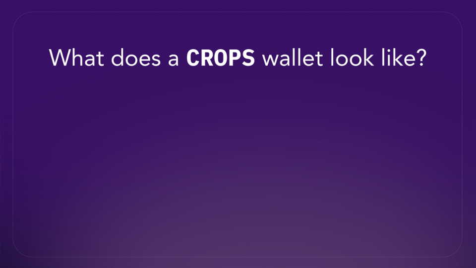
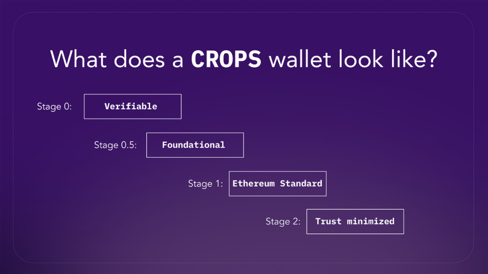

 
# Stage Evaluation Framework for Ethereum Wallets  

We’re introducing Wallet Stage Definitions to map a wallet’s progression toward self-sovereignty. The stage system is a CROPS-aligned maturity framework for wallets to grow, not a simple checklist to go through.

Walletbeat took inspiration from L2BEAT’s Rollup Maturity Framework. Stages describe the milestones Ethereum wallets should work towards. Each stage builds on the previous, forming a roadmap for wallet teams to follow.

There are many dimensions to consider when evaluating wallets. As a wallet development team, this gives you many targets to address. But: where do you start, how do you make progress, and how do you make sense of it all? This is where the Stage System comes in. We want to answer the question: What does a CROPS wallet look like?

## Stage 0: Verifiable
### Users should at least be able to see how the wallet they're using operates:

- Source Code Availability 🍝
	The source code must be publicly available so it can be reviewed.

## Stage 0.5: Foundational
Wallets should also implement the foundations of a proper Ethereum wallet.

### The wallet provides basic security protections for its users:

- Hardware Wallet Support 🗝️
	Supporting hardware wallets lets users keep their private keys offline, adding a critical layer of security.

- Transaction Legibility 🧾 
	Users must be able to see key transaction details (amount, recipient, chain, fees) before signing so they understand the transaction they are about to approve.

- Basic Authentication 🫆
	Without a lock screen, anyone who picks up a device can immediately access and transfer funds. Basic authentication is the minimum bar for protecting users against physical theft or unauthorized access.

- Basic Account Recovery Assurance 🛟
	Recovery methods can become inaccessible over time; for example, a seed phrase can become unreadable. Periodic check-ups catch this early, rather than leaving users to discover the problem only when they actually need to recover their account. 

## Stage 1: Ethereum Standard
 After that, a wallet can move on to becoming an Ethereum Standard wallet. A wallet that follows ecosystem standards, embraces interoperability, and adopts ecosystem practices.

### The wallet provides a basic level of security:

- Security Audits 📜
	The wallet must pass a security audit within the last year. An independent security audit matter in order to ensure the wallet's source code is secure, and remains that way over time. These companies report their findings to the wallet's development team for consideration.

- Hardware Wallet Interoperability 🧱
	Hardware wallets keep private keys isolated on dedicated, purpose-built devices. Direct support for multiple manufacturers ensures users are not locked into a single hardware vendor. Also, users can freely choose the device that best fits their security needs.

- Scam Alerting 🚨
	Wallets should alert users about known scams before transactions are made, helping prevent irreversible losses.

- Standard Security Practices 📋
  Standard security practices, such as storing keys in a secure enclave and requesting minimal permissions, protect users from key extraction attacks and malicious apps. These are baseline implementation requirements for a wallet that takes security seriously.

- Account Recovery 🛟
	The wallet must implement guardian-based account recovery that lets users recover their account in all likely catastrophic scenarios and must periodically prompt users to verify that their account recovery methods remain accessible.

### The wallet offers a minimal level of privacy to its users:

- Private Transfers 📨
	Without private token transfers, the user’s Ethereum activity will be publicly stored forever for the world to see. This would be the equivalent of a financial panopticon.

- Wallet Address Privacy 🔍
	Wallet addresses are unique and permanent, which makes it easy to track their activity. At minimum, wallets must not link wallet addresses to personally identifying data such as name, email, phone number, or account credentials. Linkage to IP address or pseudonyms is tolerated at this stage.

- Multi-Address Privacy 👛
	Users probably have more than one wallet address configured in their wallet, which they use for different purposes and perhaps as different identities. These wallet addresses all belong to the same user. It is therefore important to use a wallet that does not reveal that fact.

### The wallet does not lock the user in and lets the user remain in full control of their account: 

- Account Unruggability 🪚 
	No external party must be able to take over the account without the user's consent.
	True self-sovereignty requires that neither the wallet developer nor any external service can unilaterally take over the user's account.

- Account Portability 💼
	The wallet must allow users to freely export their account to another wallet.
	To avoid wallet lock-in, users must be able to export their account information and import it in another wallet.

- Support Own Node 🏠
	Blockchain censorship resistance relies on disintermediation. Without the ability to use their own Ethereum nodes, users are forced to rely on intermediaries for interacting with the chain.

- Outstanding Approvals (ERC-20) 🔑
	Outstanding token approvals are a major risk vector; they allow contracts to drain user funds long after the initial interaction. Being able to inspect (and ideally revoke) ERC-20 approvals is the baseline for protecting users from this risk.

### The wallet’s development process and internal workings are transparent to the user:

- Free and Open Source Licensing 📜
	The wallet must be licensed under a Free and Open Source Software (FOSS) license. FOSS licensing allows better collaboration, more transparency into the software development practices that go into the project, and allows security researchers to more easily identify and report security vulnerabilities.

The wallet is aligned with basic Ethereum ecosystem best practices for usability:
- Address Resolution 📧
	The wallet must allow users to send funds to human-readable Ethereum addresses (e.g. ENS). This improves the user experience of Ethereum and its layer 2 ecosystem while reducing the potential for mistakes when sending funds.

- Browser Integration 🌐
	The wallet must comply with web browser integration standards. This ensures compatibility across wallets and helps keep the Ethereum wallet ecosystem competitive through interoperability. 

## Stage 2: Trust Minimized
Lastly, a wallet can now move on to be a trust minimized wallet, where users rely less on the wallet provider, and still retains the properties of being transparent, secure, and self-sovereign.
The wallet has minimized trust assumptions on its own infrastructure while maximizing user privacy and sovereignty. Like L2BEAT, it is a high bar and we expect it will take time for any wallet to reach this stage. But the tech already exists to fulfill every single one of these criteria today.
This is the last stage of Ethereum wallets. What does it mean to be a stage 2 wallet?

Stage 2 represents the highest bar for Ethereum wallets. At this stage, the wallet should no longer have critical dependencies on intermediaries or infrastructure that can compromise a user’s ability to transact, verify, recover, or control their assets. It means the values Ethereum provides at the protocol layer are preserved all the way through the wallet and into users.

### The wallet provides a strong level of security:

- Chain Verification 🔗
	Much like browsers use HTTPS to provide integrity when doing online purchases, wallets should verify the integrity of the chain when performing transactions.

- Bug Bounty Program 🐛
	The wallet must be part of a funded Bug Bounty program.
	This aligns incentives so that security exploits are reported to the wallet developers rather than exploited.

- Duress Resistance 🔧
	A wallet should provide mechanisms such as a duress PIN or decoy wallet to protect users under coercion, limiting the effectiveness of physical theft or forced access.

- Impact Mitigation 🔒
	The wallet must let users set self-imposed limits to mitigate damage from unauthorized access.
	Spending rate-limits, high-value spend timelocks, or multiparty authorization for large transactions limit the blast radius of a compromised wallet.

The wallet collects no more information about its users by default than a web browser does:
- Minimal Data Collection 🧼
	The wallet must collect no more user data than a web browser does by default.
	Wallets handle sensitive financial data. Collecting excessive user data creates unnecessary privacy risks and undermines user trust.

- Full Wallet Address Privacy 🔍
	Wallet addresses must not be correlatable with any user information, including IP address.
	At Stage 2, wallets must go beyond avoiding sensitive personal data linkage. Even an IP address is enough to deanonymize a user across sessions and devices. All network requests carrying the wallet address must be proxied or otherwise decoupled from the user's network identity.

- App Isolation 🏝️
	The wallet must offer app-specific accounts by default when connecting to apps.
	Much like websites cannot query a browser's history from other websites by default, apps should not be able to correlate a user's activity across other apps by default. Wallets must offer per-app accounts as the default behavior when connecting to apps, and remember the addresses last used for a given app.

The wallet must not lock the user in and lets the user remain in full control of their account:
- Transaction Inclusion 🧩
	The wallet must allow users to withdraw L2 funds to Ethereum L1 without relying on intermediaries. Wallets must be able to permissionlessly submit transactions on L2s and L1 in order to be self-sovereign. L2 force-withdrawal transactions posted on L1 exercise this permissionlessness at both levels.

- Chain Configurability 🏠
	The wallet must allow the user to use their own node when interacting with any chain. Blockchains' censorship resistance properties relies on disintermediation. Without the ability to use their own Ethereum nodes, users are forced to rely on intermediaries for interacting with the chain.

- L1 Provider Independence 🏠
	The wallet must not critically depend on external providers to perform basic operations on Ethereum L1, even when the user configures their own self-hosted node.
	Merely letting the user point the wallet at a self-hosted node is not enough if the wallet still contacts its default provider before the user configures it, or relies on external services for account creation, balance lookups, or transfers. True independence requires all critical paths to depend only on the user’s own node. 

- Outstanding Approvals (Full) 🔑
	The wallet must let users inspect and revoke ERC-20, ERC-721, and ERC-1155 token approvals.
	Full approval management across all token standards is required at Stage 2. Being able to revoke approvals (not just inspect them) is critical for recovering from compromised contracts.

### The wallet's development process and internal workings are transparent to the user:

- Funding Transparency 💰
	The wallet's funding sources and revenue model must be public and transparent.
	Wallets are complex, high-stakes pieces of software. They must be maintained, regularly audited, and follow the continuous improvements in the ecosystem. This requires a reliable and transparent source of funding.

- Release Process Safety 📦
	The wallet release process must follow safety best practices.
	A well-defined release process with artifact signing, reproducible builds, and dependency locking reduces supply chain attack risk.

- Fee Transparency 💸
	The fees charged by the wallet must be made transparent to the user at all times.
	Wallets may charge fees to the user for convenience services or simply to interact with the chain (gas fees). Whenever they do, the user deserves to know what they are paying for.

- Orderflow Transparency 🗺️
	The wallet must transparently disclose how it monetizes or shares transaction data before it is included onchain.
	Wallet software may send transaction data to external services for broadcast, simulation, or orderflow auctioning before inclusion onchain, a path less visible than onchain execution. Wallets that auction orderflow by default must disclose this prominently, and any pre-inclusion data sharing must use verifiably non-extractive endpoints.

### The wallet is aligned with advanced Ethereum ecosystem best practices for usability:

- Chain Abstraction 🌉
	The wallet must smooth out the complexities of dealing with multiple chains.
	A lot of Ethereum activity has moved onto rollups and Layer 2 chains, fragmenting token balances and account value across multiple chains. Wallets should abstract away this complexity, showing users their cross-chain balances and providing a built-in way to bridge assets between chains.

- Chain-Specific Address Resolution 📧
	The wallet must support chain-specific human-readable addresses (e.g. ERC-7828, ERC-7831).
	Including the destination chain in the address reduces wrong-chain sends and improves the user experience of Ethereum's layer 2 ecosystem.

- Account Abstraction 👤
	The wallet must be Account Abstraction ready.
	Account Abstraction is a massive UX upgrade and security for Ethereum users. Wallets must support it through open standards to preserve account portability and interoperability.

- Transaction Batching 🧺
	The wallet must support atomic batched transactions.
	Batched transactions through the WalletCall API enable better UX for common DeFi workflows, such as token approvals followed by a DeFi operation. Atomic batched transactions make such batched transactions safer and easier to understand for the user, as well as enabling advanced DeFi use-cases.

Ethereum values should land in wallets. We're trying to solve the last mile delivery problem through the stage system. The stage system is a roadmap for Ethereum wallets to adopt Ethereum values.

Walletbeat is a rating system for Ethereum wallets. We use a framework to evaluate wallets across five dimensions: Security, Privacy, Transparency, Ecosystem Alignment, and Self-sovereignty. The same values that CROPS stands for.

Ethereum values in wallets are what we call the last-mile delivery problem. These values don't mean much on their own if users don't actually experience them. We've built the stage system as a roadmap for Ethereum wallets to progressively adopt these values and deliver them to users. Ultimately, Ethereum values should land in wallets, and that's the problem we're trying to solve.

If you want to know more about our stages, please visit https://beta.walletbeat.eth.limo/stages/

