Ethereum prides itself on being verifiable.

For wallets, that starts with one question: can you see the source code?

At @walletbeat, public source code is a Stage 0 requirement.

So, how do the top Ethereum wallets stack up? 🧵

BONUS: Are they fully open source?

---

Why does source availability matter?

Your wallet holds your private keys.

If you can't inspect the code running your wallet, you can't check what it does. You're trusting the wallet provider's word.

Source-available wallets should be the default.

---
Taking it a step further, wallets should raise the bar and do FOSS. What does that mean?

Source available means anyone can inspect a wallet's code.

FOSS goes further: users can freely use, modify, and distribute the code.

This enables more collaboration, transparency, and security research.

---

@ambire

✅ Uses Free & Open Source license (Under GPL-3.0)

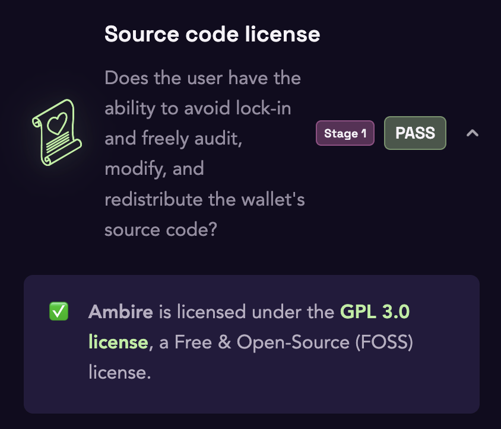

---

@baseapp

❌ Not open source (Proprietary)

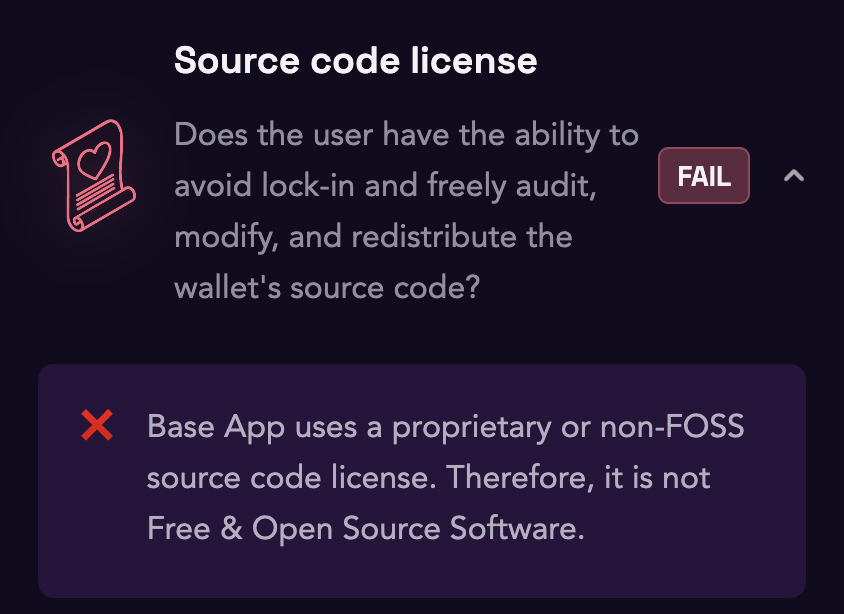

---

@BitgetWallet

❌ Not open source (Proprietary)

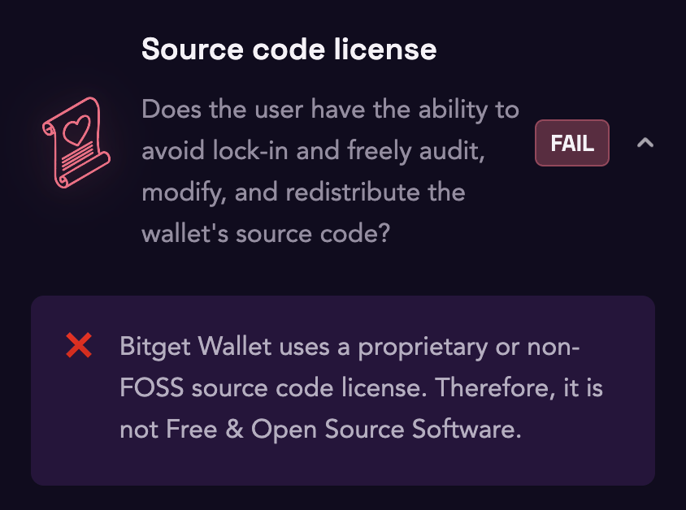

---

@daimopay

✅ Uses Free & Open Source license (Under GPL-3.0)

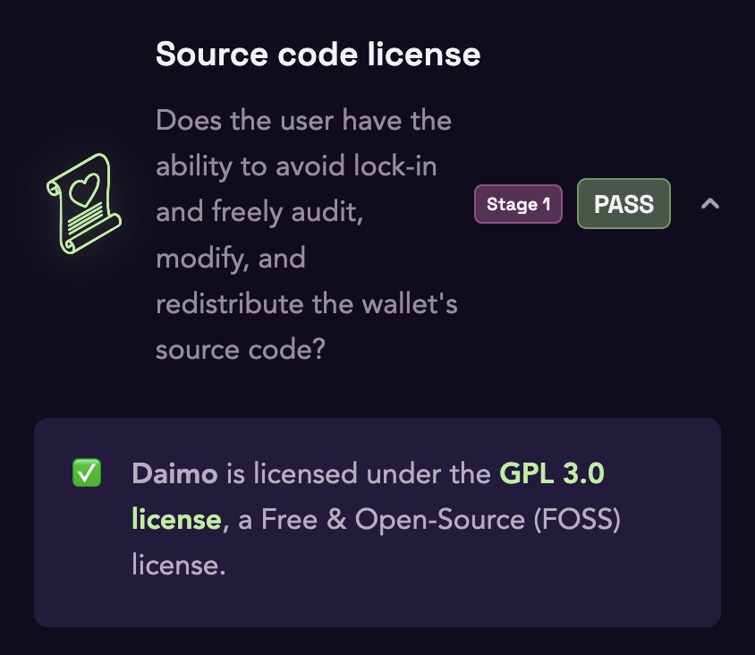

---

@gemwallet

✅ Uses Free & Open Source license (Under GPL-3.0)

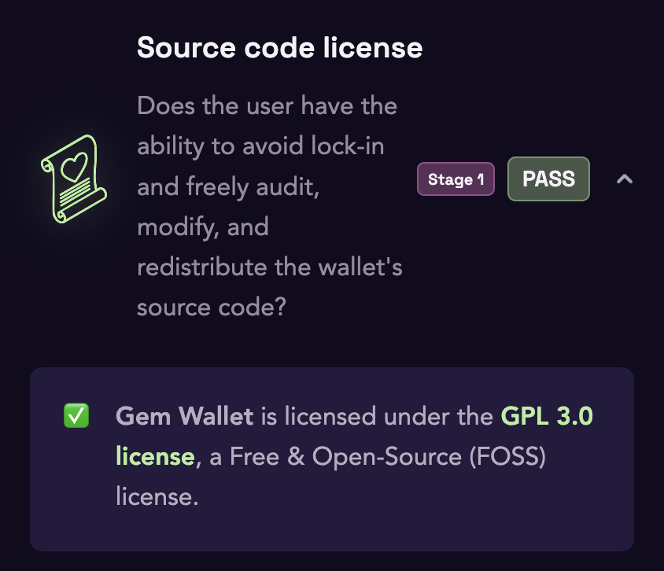

---

@imTokenOfficial

❌ Not open source (Proprietary)

Core code is open source under Apache 2.0, but the app itself is proprietary.

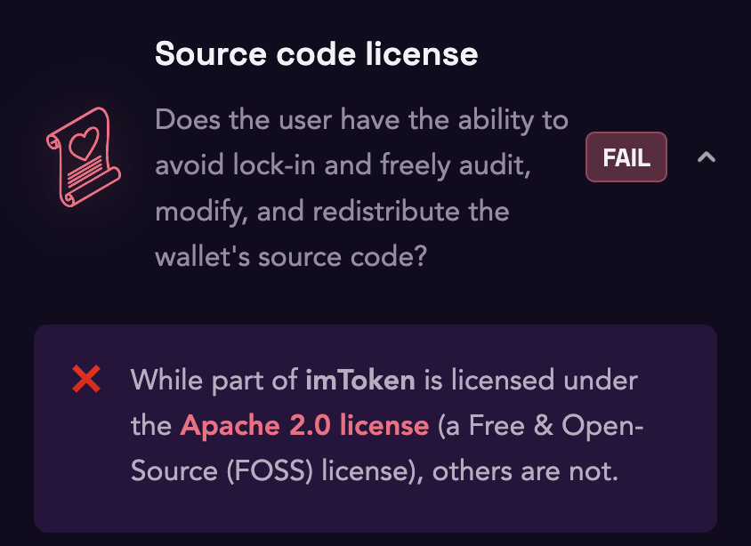

---

@MetaMask

⚠️ Source available, but not FOSS (Proprietary source-available license)

Core packages are MIT, but the extension and mobile app use a proprietary license.

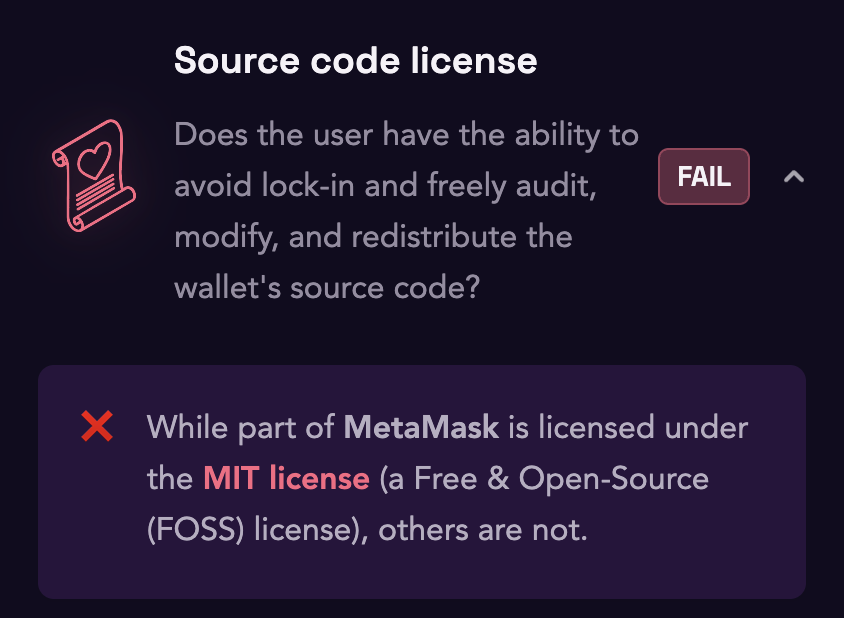

---

@mtpelerin (Bridge Wallet)

❌ Not open source (Proprietary)

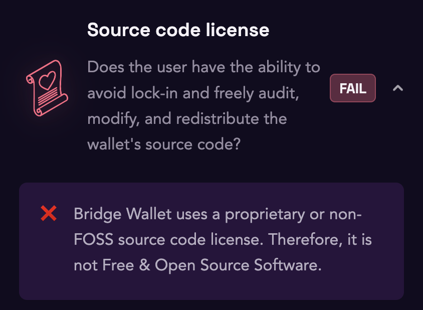

---

@nufiwallet

❌ Not open source (Proprietary)

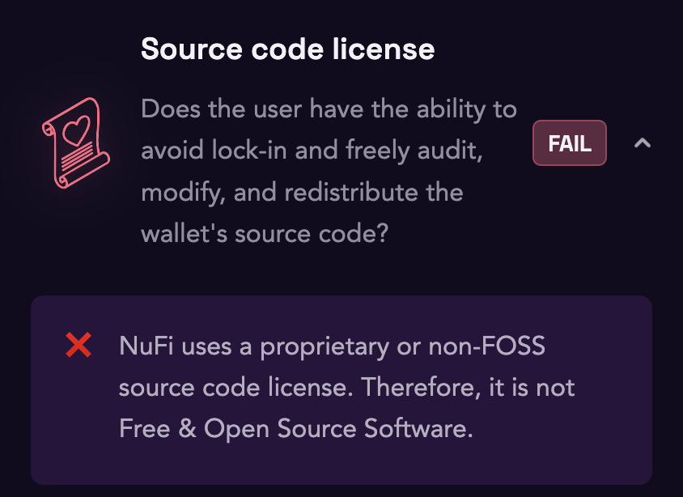

---

@wallet (OKX Wallet)

❌ Not open source (Proprietary)

---

@phantom

❌ Not open source (Proprietary)

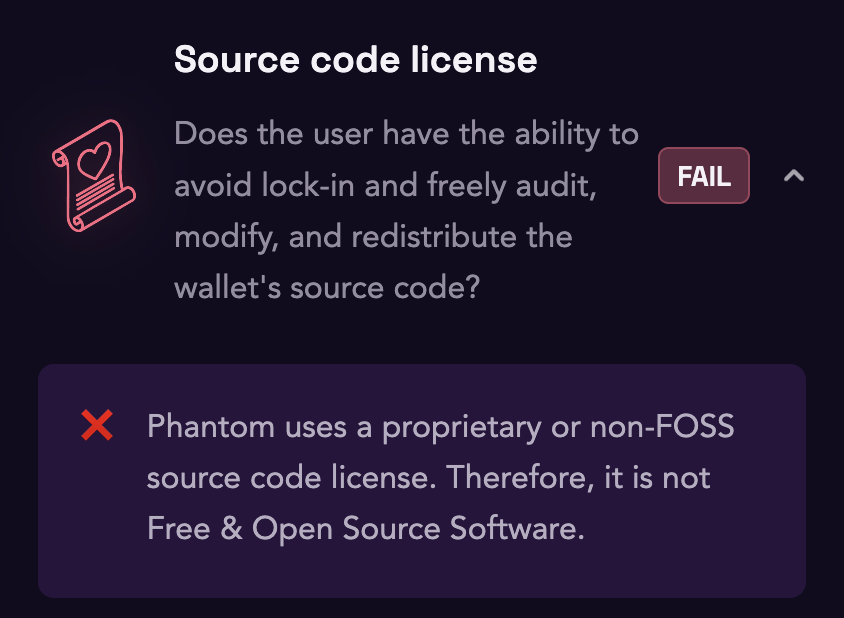

---

@PX_Web3 (PillarX)

✅ Uses Free & Open Source license (Under MIT)

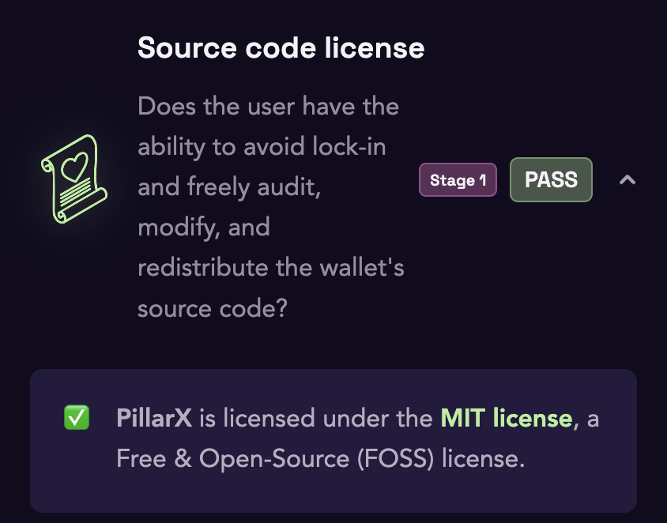

---

@Rabby_io

⚠️ Source available, but not fully FOSS

Browser extension and desktop app: ✅ MIT
Mobile app: ⚠️ Unlicensed (code visible, no license)
Core: ⚠️ rabby-api package is unlicensed

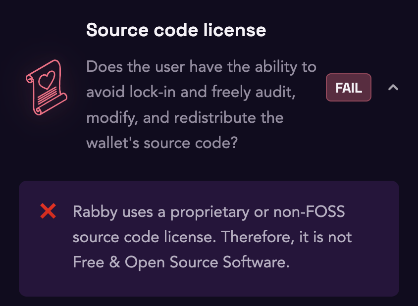

---

@rainbowdotme

✅ Uses Free & Open Source license (Under GPL-3.0)

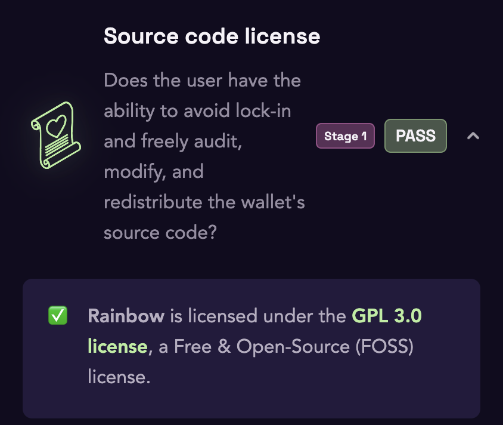

---

@safe

✅ Uses Free & Open Source license (Under GPL-3.0)

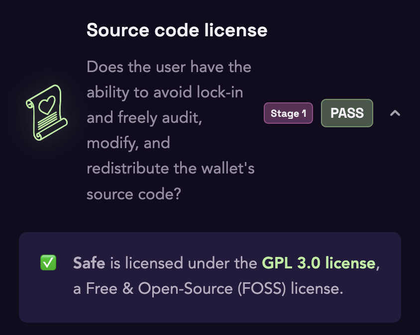

---

@Uniswap (Uniswap Wallet)

✅ Uses Free & Open Source license (Under GPL-3.0)

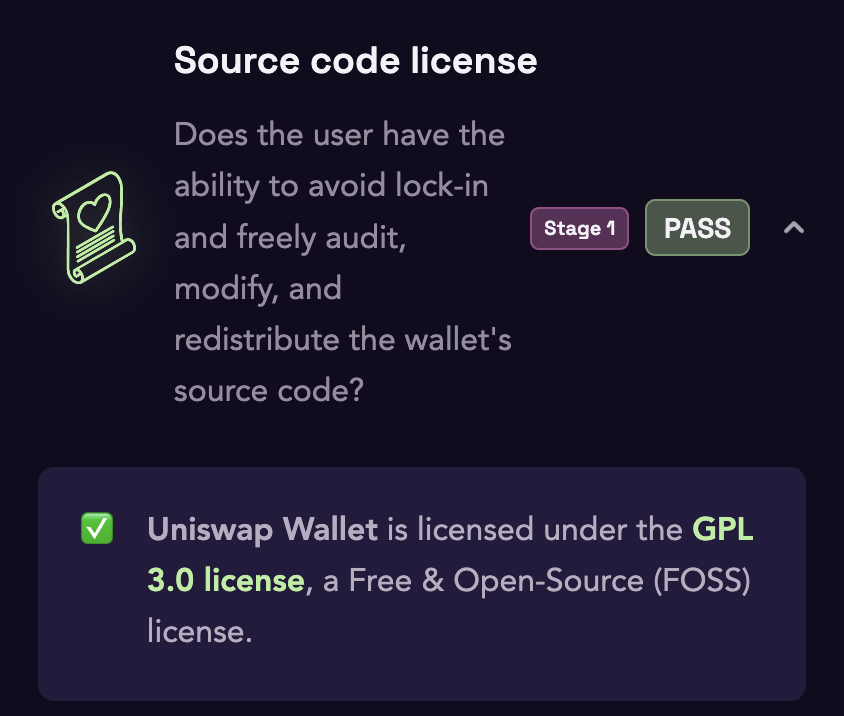

---

@zerion

⚠️ Partially open source

Browser extension: ✅ GPL-3.0
Mobile app: ❌ Proprietary (only the wallet core is open source, under Apache 2.0)

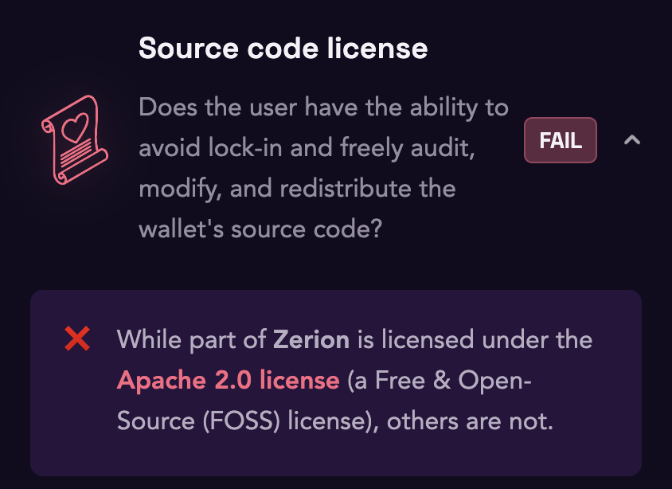

---

@ZeusLN

✅ Uses Free & Open Source license (Under MIT)

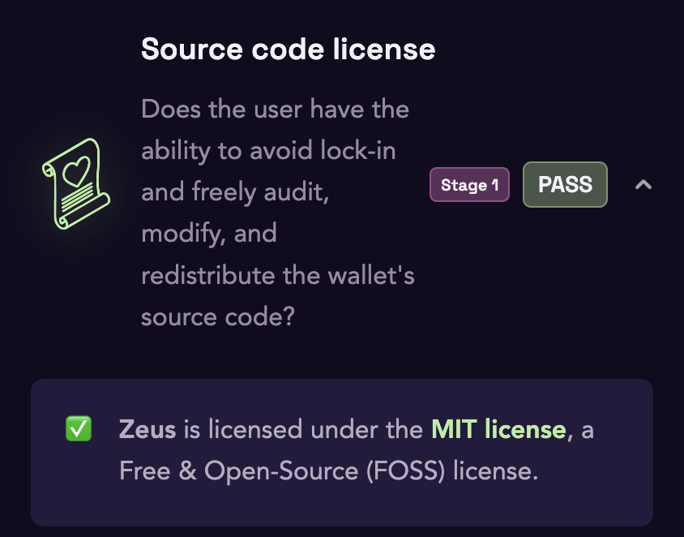

---

15/18 wallets are source available.

Of those, only 8/15 are fully Free & Open Source.

Source availability should be a basic requirement for any Ethereum wallet.

And FOSS should be the standard.

---

Why source availability matters:

Your wallet holds your keys. If the code is closed, you're trusting the provider's word on what it does.

Public source code lets anyone inspect how the wallet works, so security researchers and users can spot bugs or shady behavior.

But it only lets you read the code. Without a FOSS license, you can't fork, fix, or ship your own version.

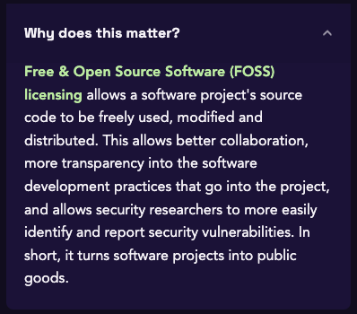

---

Why FOSS should be the standard:

Anyone can audit, modify, and redistribute the code. Users avoid lock-in, researchers can freely find and report bugs, and other teams can build on it.

That turns a wallet into a public good, which is what Ethereum is about.

---

If your wallet's source code isn't available, you can't see what it does with your keys, your transactions, or your data.

Is it really an Ethereum wallet?

Ethereum is built on openness, transparency, and not having to trust anyone. Those values should land on wallets too, where users actually touch Ethereum.

---

Using a wallet that isn't FOSS yet?

Let them know. Tag them and ask them to open source their code.

Wallets listen to their users.

---

Check out how your wallets stack up 👇
https://beta.walletbeat.eth.limo/
