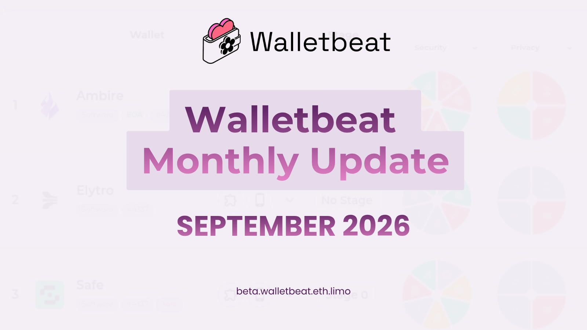
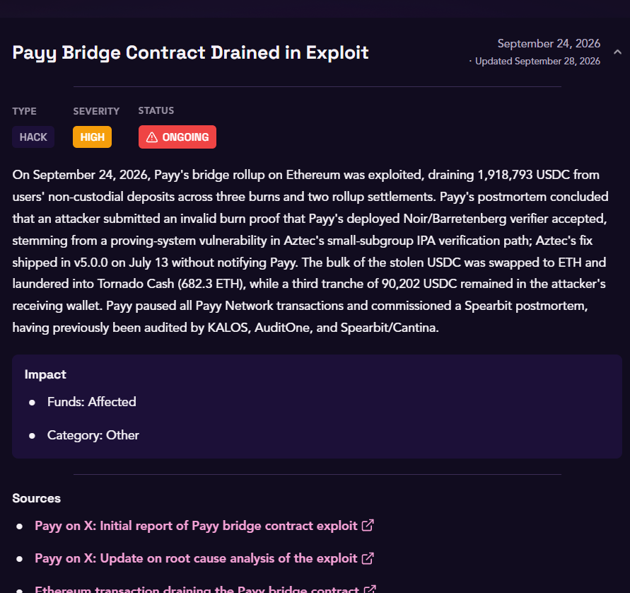

Walletbeat monthly update is here! 🌸

Check out what happened across Walletbeat and the wallet ecosystem through September 👇

---

Earlier this month we asked: can your wallet send and receive tokens without exposing your transaction history to others?

https://x.com/walletbeat/status/2099669827568996377 
https://x.com/walletbeat/status/2099669769343439312

@ambire announced they're fixing this, and working on their privacy transfers score.

https://x.com/ambire/status/2099770434400969010 
https://x.com/0xSuperKalo/status/2099864981852262633

---

Methodology update: Permissions Management is now a rated attribute.

If a wallet has a built-in swap or bridge feature, any unlimited default approval fails, whether disclosed or not. Users must also be able to inspect and revoke standing approvals.

August's unlimited-approvals research is now a permanent part of how every wallet gets scored.

https://github.com/walletbeat/walletbeat/commit/86de5a8525dc61fad58020cad11085152885e1f0

---

Duress Resistance got sharper too.

A wallet that locks with biometrics alone, no required PIN or password fallback, no longer passes. A fingerprint can be taken from you under duress. A password can be refused.

https://github.com/walletbeat/walletbeat/commit/4f3b7436e9cca205b4b781bf5d67271890911515

---

New wallet, fully onboarded: @gemwallet went from a placeholder stub to real coverage this month, security, self-sovereignty, hardware wallet support, the works.

Same treatment Phantom got in August.

https://github.com/walletbeat/walletbeat/commits/beta/data/software-wallets/gemwallet.ts

---

Walletbeat's wallet rating data is now on @casberi_app too.

Our data has always been open-source, MIT-licensed, and continuously updated. Now it's easier for other tools to build on it directly.

https://x.com/walletbeat/status/2097741495142944783

---

Clear signing tracking expanded across 9 wallets this month: MetaMask, Ambire, Rainbow, Rabby, Zerion, Phantom, Uniswap, OKX, and Bitget all got ERC-7730 data added.

More wallets we can now show users whether their transactions are actually legible before they sign.

---

Deep re-verification continued across the top wallets: transaction submission on L1 and L2, EOA account support, and key handling, all independently re-sourced for MetaMask, Rabby, Rainbow, Ambire, and Zerion.

Every claim traced back to the code, not to a wallet's own marketing.

---

Security news, briefly:

A shared newsletter provider used by both Trezor and BitBox was compromised, and used to send phishing emails from their real domains. Both companies caught it, warned subscribers, and are still investigating.

https://x.com/Trezor/status/2097786518110609620 
https://x.com/BitBoxSwiss/status/2097793026336981079

---

Payy's bridge contract was drained in an exploit on September 24, about $1.92M in USDC pulled from users' non-custodial deposits.

Postmortem update: It appears there was a proving-system vulnerability in the Noir/Barretenberg verifier, developed by Aztec.

Want the full breakdown? https://beta.walletbeat.eth.limo/news/

---

Transparency update: Coinspect is now a formal data source on every wallet page.

Walletbeat already cited external audits informally. Now there's a proper credit system, so you can see exactly which of our findings trace back to independent security research.

https://github.com/walletbeat/walletbeat/commit/9600d94300d05545d568ddaa5862516df8cb9016

---

Custom RPC? Cool. Oh wait...

Another excellent find by @REN2140_eth, rendered thanks to @0xMattmatt's new in-page code snippets feature. Guess the wallet, or just visit the site to find out.

https://x.com/walletbeat/status/2104824404781777180

---

Looking ahead: 4 Walletbeat talks got accepted to Devcon.

Solving CROPS' last-mile problem. Help watch the wallets: building the CROPS-legible dataset. Beyond clear signing: what else should wallets do? Wallets and software supply chain security.

We'll also have our own booth this year, so very excited to see you there 👀

We're preparing our attendance, more soon.

https://github.com/walletbeat/walletbeat/tree/beta/resources/talks/2026-11-devcon

---

Wallets are one of the most critical layers of the crypto ecosystem. We keep watching 🫡

Until next month! 🌸