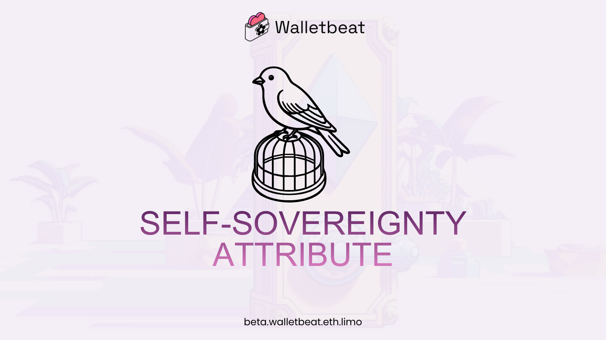
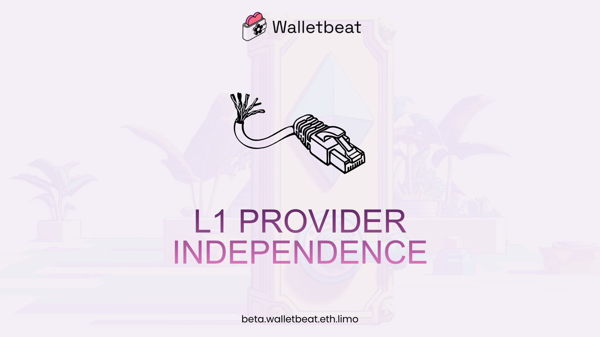
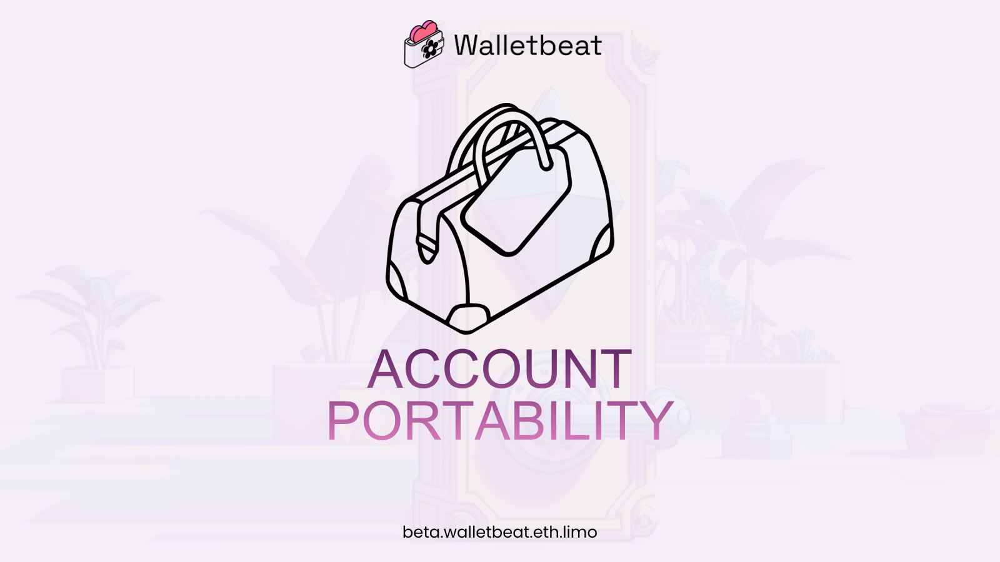
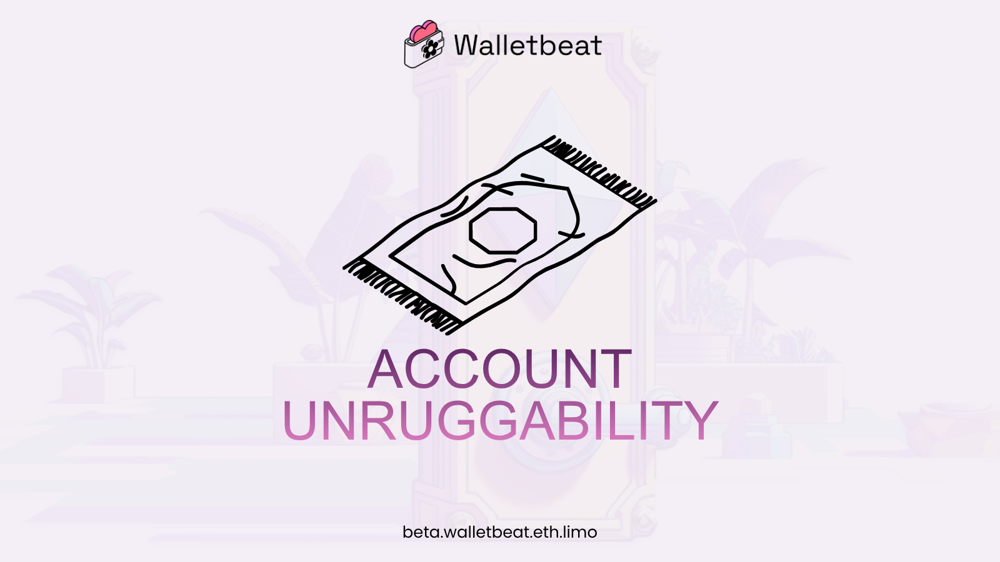
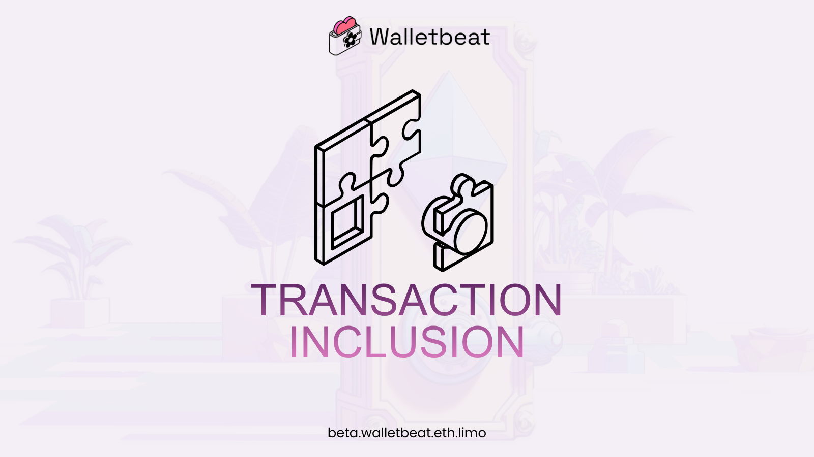
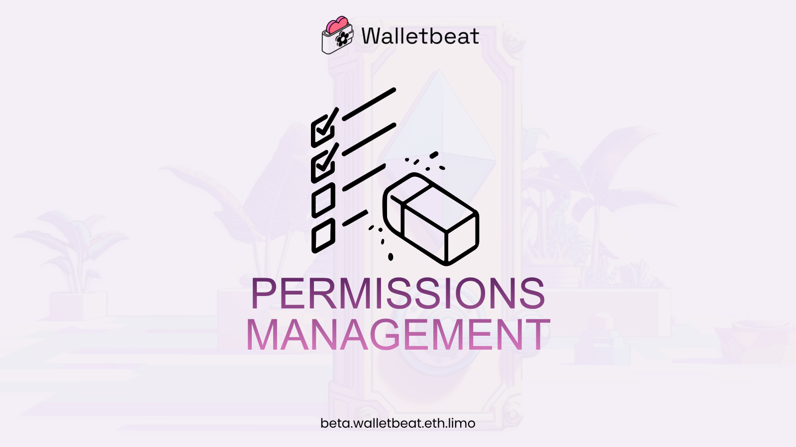
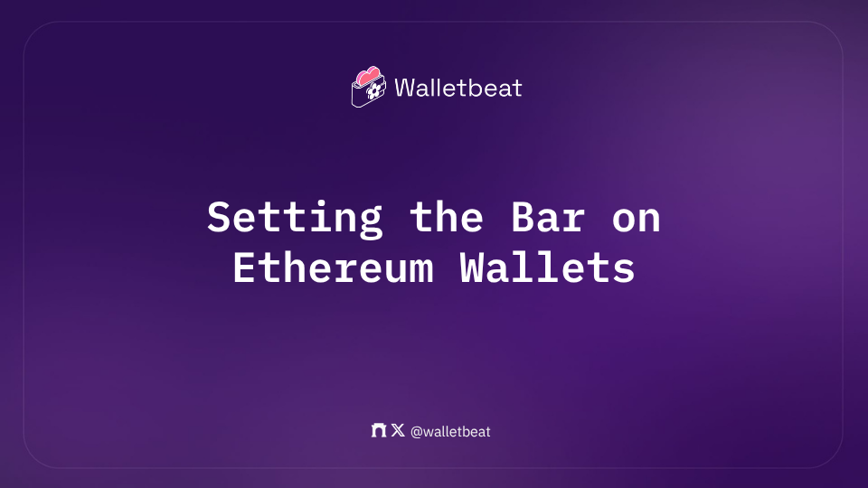

Censorship Resistance is one of the core values of Ethereum, yet what does it actually mean for an Ethereum wallet to be "self-sovereign"?

What if a wallet's dev team walked away or turned evil one day? How much control and ownership over your account does your wallet give you?

Here's how Walletbeat evaluates self-sovereignty, and why these attributes matter 🧵

---

L1 Provider Independence

Can you use the wallet without relying on its default provider for interacting with the L1 chain?

wallets must allow the user to configure the L1 RPC endpoint to a self-hosted node before any request is made to that endpoint.

---

Why does this matter?

Running your own node gives you several important benefits: privacy, integrity, censorship resistance, and no downtime. 
However, these advantages only matter if wallets allow users to use a self-hosted node for these benefits to be realized in practice.

---

Account Portability

Are you locked into this wallet? Or can you permissionlessly import your Ethereum account into another wallet? 

One of Ethereum's core promises as an Internet upgrade is to avoid the possibility for user lock-in of web2. This is achieved by ensuring accounts are permissionlessly portable across wallets.

---

Why does this matter?

Ensuring that accounts remain portable avoids wallets becoming lock-in vectors in web3. Permissionless account portability also keeps the wallet ecosystem healthy through open competition.

---

Account Unruggability

Can the wallet developer take over your account without your consent?

The underlying property that makes an account truly yours is the inability for anyone other than yourself to act on your behalf or to take over your account without prior consent.

---

Why does this matter?

The promise of crypto is to make your accounts and your funds truly yours. This is what is most commonly referred to when discussing "self-sovereignty".

---

Transaction Inclusion

Can the wallet withdraw L2 funds to Ethereum L1 without relying on intermediaries?

Users must be able to reliably get transactions included onchain, without the ability for intermediaries to prevent this from happening.

---

Why does this matter?

This property is critical to ensure that all Ethereum participants are provided equal-opportunity, unfettered access to Ethereum, and to ensure that Ethereum is resilient to attackers that would want to prevent others from using Ethereum on such footing.

---

Permissions Management

Does your wallet let you inspect and manage the permissions you've granted to other contracts and apps?

Without the ability to inspect and revoke approvals, users are exposed to risks from unlimited or unnecessary token approvals granted to other addresses.

---

Why does this matter?

Token approvals grant other addresses, such as contracts or accounts, permission to spend tokens on your behalf. Malicious or compromised contracts with existing approvals can drain your wallet, and approvals to other accounts carry the same risk.

---

The role of Walletbeat is to push the Ethereum wallet ecosystem forward, because Ethereum values only matter if users actually experience them.

Please visit our website to see where we currently are 🌸 Let's keep pushing CROPS in wallets. 

https://beta.walletbeat.eth.limo/about/