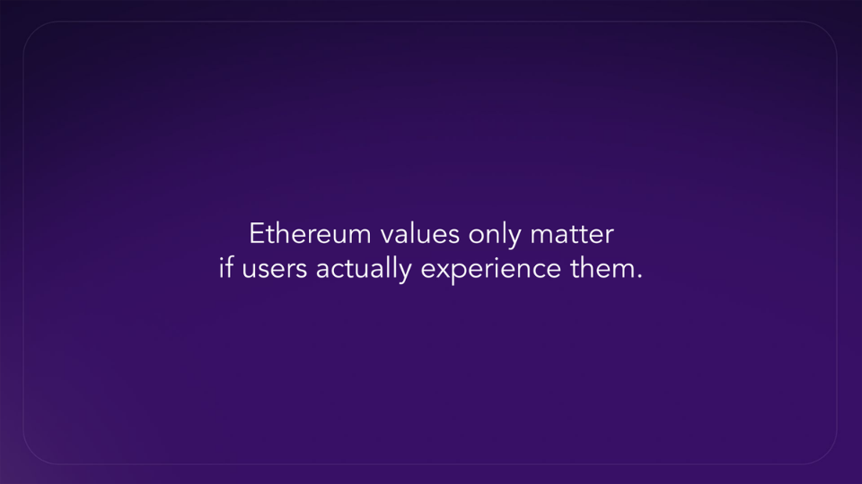
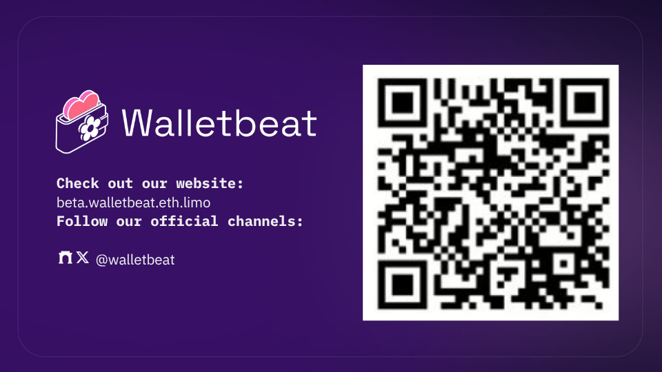

Beyond Clear Signing: What Else Should Wallets Do?

Walletbeat contributor @0xmattmatt will take the stage at @EFDevcon 8 on Users, Builders, and Agents track 👇

---

Clear signing is an important step toward safer wallet interactions, but it's only one piece of the puzzle. 

@0xMattmatt looks beyond clear signing at other ways wallets can protect user intent. 

From scam alerting and transaction simulation to emerging work on enforceable transaction constraints.

---

Clear signing addresses a fundamental wallet problem: users should understand what they're authorizing. But that's only one question a wallet can help answer. 

Scam alerting can provide context about who a user is interacting with, while transaction simulation can show what is likely to happen before they sign.

---

Further out, research into frame transactions and enforceable transaction constraints points toward a stronger model: 

Wallets could help users bound what a transaction is allowed to do, not just explain what it intends to do.

---

This lightning talk maps these approaches as complementary ways to protect user intent, then highlights the challenge they share: 

None of them protect users until they make it through the access layer and into real wallets.

---

Wallets are where users make critical decisions about what they authorize. 

Clear signing, scam alerting, transaction simulation, and enforceable transaction constraints approach that problem from different angles: helping users understand, evaluate, and ultimately constrain what they authorize. 

Bringing these mechanisms into real wallets strengthens security and self-custody at the layer where users actually make those decisions.

--- 

Check out @0xMattmatt's latestes talks 

At @BerlinMeetup, he covered what CROPS alignment actually looks like in practice for modern wallets 🔍    
https://youtu.be/2rIVB8WH_-I?si=tnBuRi7viaiI55XQ

---

At @dappcon, he hosted a workshop using our testing playground to evaluate real wallets across transaction simulations, signatures, and scam alerts.

He also dove into EIP-7730, EIP-8213, and what they actually mean for wallet UX and safety 🌸
https://www.youtube.com/watch?v=zOL73Ll_6N0&t=1956s

---

Why should we listen to us about wallets?

Walletbeat is a rating system for Ethereum wallets. A place where users know what to expect from a wallet, developers have a clear standard to build toward, and wallets compete on Ethereum values.

See you in @EFDevcon Why should we listen to us about wallets?

Walletbeat is a rating system for Ethereum wallets. A place where users know what to expect from a wallet, developers have a clear standard to build toward, and wallets compete on Ethereum values.

See you in @EFDevcon 🇮🇳

