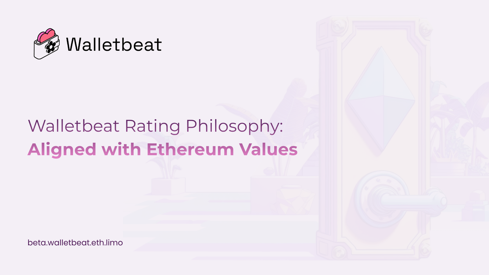
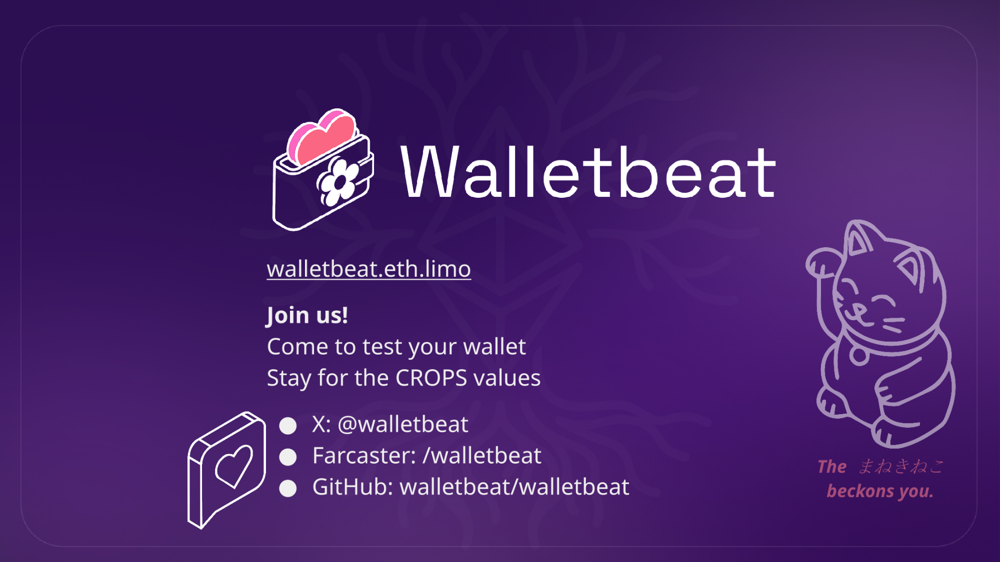

We want to share more about the philosophy of how wallets are rated on Walletbeat ⬇️
      
🌸 We want to align with @ethereum values: Security, Privacy, Self-sovereignty, Transparency, and Ecosystem Direction.

---

🌸 We base all the attributes' evaluations on verifiable behavior of wallets. 

This means, for example, that instead of looking at privacy policies of wallets, we'll actually look at network packets that they send, because that's a much more objective property that wallets do.

If something is not verifiable, that also means that the wallet is failing in some dimension of the transparency value.

---

🌸 We don't pick winners. That means that Walletbeat cares more about outcomes for the user, as opposed to specific standards. A good example here would be private transfers. 

There are many ways to do private transfers on @ethereum. There's @TornadoCash, @RAILGUN_Project, @0xprivacypools, stealth addresses.

---

And Walletbeat is not here to pick a solution between them. 

Walletbeat is here to make sure that users get privacy onchain, and it doesn't really matter what implementation wins out. 

What matters is that it's implemented in an actually privacy preserving manner, and it provides privacy for users onchain.

---

🌸 Walletbeat is also limited to what's technically feasible in the present.

For example, we don't ask browser extension wallets to do things browser extensions can't do. So our methodology has to be limited by that principle as well. 

The bar will rise as technology progresses.

---

🌸Our bar is set high first because is much easier to lower it later, as opposed to start low and then raise it.

---

If you want to know more about our values, please visit 
https://beta.walletbeat.eth.limo/about/

